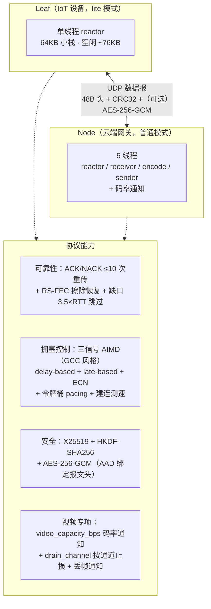

# tight — 可靠 UDP 传输协议库

tight 是一个自包含、零第三方依赖的 C++17 可靠 UDP 传输库，面向**端云实时通信**
场景（IoT 设备 ↔ 云端网关）：一端是资源充裕的多并发服务器，另一端是 RAM/CPU/
功耗受限的嵌入式设备，同一份代码、两种运行模式覆盖两侧。

- 跨平台：Windows（MinGW/MSVC）与 Linux（WSL Ubuntu 已验证，10/10 ctest 套件全绿）
- 零依赖：仅系统 socket（ws2_32 / POSIX）+ 线程库，加密原语为内置纯 C++ 实现

## 项目设计概览



详细设计文档：[功能总结](docs/tight_overview.md) ·
[架构](docs/tight_architecture.md) · [设计](docs/tight_design.md) ·
[API 参考](docs/api_reference.md) · [使用](docs/usage.md)。

## 特性

**可靠性**
- ACK 确认 + NACK 重传：丢失序号确认前每个报告周期重复上报（Report 丢失不致命）；
  缺口超 3.5×RTT 即跳过（ack 游标不停滞），迟到重传照常投递；每包最多重传 10 次
- 心跳保活 + `dead_timeout` 掉线检测 + 自动重连
- **重传可协商**：`retransmit_enabled` 经握手能力标志通告，任一端可单方面关闭
  链路重传（纯 FEC 兜底），在途内存从 ∝码率 降为常数 ~24KB
- per-channel ARQ：`channel_reliable[8]` 按通道开关重传（file/data 可靠、
  实时视频纯 FEC 低延迟）

**安全**
- 握手 X25519 密钥交换（RFC 7748），HKDF-SHA256 派生会话密钥
- 数据面（Data/Parity/Command）AES-256-GCM 加密，报文头做 AAD 绑定，可配置开关
- token 接入认证 + CRC32 完整性 + 畸形分片防御（`max_message_bytes`）

**性能**
- Reed-Solomon FEC（GF(2⁸) Vandermonde）：冗余率由迟到率信息熵 H(p)×1.2 动态驱动，
  RTT >200ms 自动关闭冗余让出带宽
- **三信号 AIMD 拥塞控制（GCC 风格）**：delay-based（排队延迟 = P50−RTprop，
  EWMA>20ms）+ late-based（迟到率>1%）触发 ×0.5 降速；恢复两步台阶 ×1.5
  （FEC 校验片先行探测链路余量）；btl 下限 100kbps，提升上限 = 配置种子
- 建连带宽探测（100KB 探测列车，可开关）；时钟对表（握手 + 每次心跳）
- 消息优先级：音频不被文件流阻塞；命令通道单报文保序插队

**视频专项**
- **`video_capacity_bps()` 码率通知**：有效带宽 − 音频预留 − file/data 实时速率
  − FEC 冗余折算后的编码码率，变化 >10% 且 >100kbps 才回调（专用通知线程）
- **`drain_channel()` 按通道止损**：排空期内该通道数据报出队即丢（不清队列），
  音频/文件通道完全不受影响；`clear_outbound()` 保留音频清空视频积压
- `message_loss_callback` 丢帧通知 + `late_buffer_ms` 动态迟到线 + P50 延迟信号

**资源**
- lite 精简模式（IoT 端侧）：单线程 reactor、64KB 小栈、队列容量自动收紧，
  空闲实例 **~76KB**，`set_lite_mode()` 运行时切换
- 默认 MTU 1350：单包载荷 1286B，恰好整包容纳 16kHz PCM 40ms 音频帧（1280B）

## 目录结构

```
tight/
├── CMakeLists.txt            # 库构建（独立 / add_subdirectory 两用）
├── include/tight/            # 公共 API
│   ├── tight.hpp             #   TightTransport 主接口（聚合头）
│   ├── types.hpp             #   基础类型 + TightConfig
│   ├── packet_codec.hpp      #   线格式编解码 + CRC32
│   ├── fec.hpp               #   ReedSolomon 擦除码
│   ├── bandwidth.hpp         #   三信号 AIMD 带宽估计器
│   ├── blocking_queue.hpp    #   有界阻塞队列（节点回收池）
│   └── logger.hpp            #   TIGHT_LOG_* 日志宏
├── src/                      # 私有实现（namespace tight::tight_detail）
│   ├── transport.cpp         #   核心：线程模型/收发/握手/加密/码率通知/通道排空
│   ├── report.cpp            #   ACK/NACK 报告构建与处理（重传驱动）
│   ├── reassembler.cpp       #   分片重组 + 缺口/慢包统计
│   ├── fragmenter.cpp        #   分片 + FEC 分组（冗余统计）
│   ├── command.cpp           #   命令通道（保序）
│   ├── crypto.cpp            #   X25519/SHA-256/HKDF/AES-256-GCM
│   ├── fec.cpp / bandwidth.cpp / packet_codec.cpp / address.cpp / crc32.cpp
│   ├── buffer_pool.hpp       #   出站数据报缓冲池（2048B 块）
│   └── peer.hpp / wire_format.hpp / socket_platform.hpp / small_thread.hpp
├── tests/                    # 单元测试（ctest，92 用例 / 10 套件）
│   ├── test_framework.hpp    #   极简测试框架（无第三方依赖）
│   ├── test_crypto.cpp       #   X25519/SHA-256/HKDF/AES-GCM 标准向量
│   ├── test_fec.cpp          #   Reed-Solomon 编解码/擦除恢复
│   ├── test_packet_codec.cpp #   线格式编解码 + CRC32 校验
│   ├── test_bandwidth.cpp    #   AIMD 估计器（拥塞/恢复台阶/下限/pacer 否决）
│   ├── test_reassembler.cpp  #   重组/FEC 恢复/丢失通告/缺口跟踪
│   ├── test_fragmenter.cpp   #   分片/分段 FEC/通道冗余（含往返集成）
│   ├── test_command.cpp      #   命令通道保序/跳号
│   ├── test_crc32.cpp / test_address.cpp / test_blocking_queue.cpp
└── docs/
    ├── tight_overview.md     # 功能总结（能力全景/可靠性/安全/性能/通道）
    ├── tight_architecture.md # 架构文档（分层/线程/数据流/状态机/内存，mermaid）
    ├── tight_design.md       # 设计文档（线格式/握手/可靠性/FEC/拥塞控制/决策，mermaid）
    ├── api_reference.md      # API 说明（TightTransport/TightConfig/类型/辅助组件，mermaid）
    ├── usage.md              # 完整使用文档（示例/配置/API/行为约定/配方）
    └── litemode/             # lite 模式设计文档集（需求/架构/API/安全/内存）
```

## 构建

### 集成到宿主工程（推荐）

```cmake
add_subdirectory(tight)
target_link_libraries(your_app PRIVATE tight)
```

### 独立构建

```bash
# Windows (MinGW)
cmake -B build -S . -G "MinGW Makefiles" -DCMAKE_CXX_COMPILER=g++
cmake --build build -j 4

# Linux
cmake -B build -S . && cmake --build build -j 4

# 安装
cmake --install build --prefix /your/prefix
# 头文件: prefix/include/tight/  库: prefix/lib/libtight.a
```

### 单元测试

```bash
# 独立构建后运行全部测试（10 套件 / 92 用例）
ctest --test-dir build --output-on-failure
```

测试覆盖加密标准向量（RFC 7748 X25519、RFC 5869 HKDF、NIST GCM）、
Reed-Solomon 擦除恢复、报文编解码/CRC、AIMD 带宽估计（拥塞降速/两步恢复
台阶/100kbps 下限/pacer 否决）、分片重组/FEC 往返集成、命令通道保序、
有界队列与地址解析。

## 快速上手

### 服务器（Node 角色）

```cpp
#include "tight/tight.hpp"

tight::TightConfig cfg;
cfg.bind  = tight::NetAddress("0.0.0.0", 9443);
cfg.id    = "gateway";
cfg.token = "shared-secret";
cfg.role  = tight::LinkRole::Node;          // 服务器必须 Node

tight::TightTransport server(cfg);
server.set_message_callback([&](const std::string& peer, tight::Bytes payload) {
    server.send(peer, std::move(payload));  // echo
});
server.start();
```

### 客户端（Leaf 角色，lite 模式）

```cpp
tight::TightConfig cfg;
cfg.bind      = tight::NetAddress("0.0.0.0", 0);
cfg.id        = "device-001";
cfg.token     = "shared-secret";
cfg.lite_mode = true;                        // 单线程低占用

tight::TightTransport client(cfg);
client.set_message_callback([](const std::string&, tight::Bytes p) { /* ... */ });
client.start();
client.connect({"gateway", tight::NetAddress("127.0.0.1", 9443)});
client.send("gateway", {'h','i'});
client.send_command("gateway", {'c','m','d'});   // 命令通道（保序、插队）
```

完整的设备端/网关端示例（音频+视频+文件混合流、优先级、错误处理、
视频码率通知与按通道止损）见 [docs/usage.md](docs/usage.md) 第 4、5 节。

## 关键配置（`tight::TightConfig`）

| 字段 | 默认 | 说明 |
|---|---|---|
| `role` | Leaf | Node = 接受接入（服务器）；Leaf = 终端设备 |
| `mtu` | **1350** | 单包载荷 = mtu-48（开 GCM 再 -16 = 1286B） |
| `encryption_enabled` | true | X25519 + AES-256-GCM |
| `retransmit_enabled` | true | NACK 重传；关闭经握手通告对端（任一端可单方面关） |
| `max_message_bytes` | 64KB | 单消息上限，钳制 [8KB, 10MB] |
| `heartbeat` / `dead_timeout` | 5s / 30s | 保活与掉线检测 |
| `report_interval` | 1s | ACK/NACK 报告周期（视频 333ms） |
| `flush_interval` | 10ms | 排空节拍；lite 自动 ≥10ms（IoT 省 CPU） |
| `late_rtt_multiplier` | 4.0 | 慢包阈值（倍 RTT），驱动 FEC 冗余 |
| `initial_bandwidth_bytes` | **1.25MB（10Mbps）** | AIMD 初始 btl 与**提升上限**（种子） |
| `audio_reserved_bps` | 0 | 音频编码码率，`video_capacity_bps` 计算时扣除 |
| `speed_test_enabled` / `speed_test_bytes` | true / 100KB | 建连带宽探测 |
| `queue_limit` | 65536 | 发送队列消息数（lite ≤128） |
| `socket_buffer_bytes` | 8MB | 内核收发缓冲（lite ≤16KB） |
| `drop_log` | true | 异常消息丢弃告警（lite 强制关闭） |
| `lite_mode` | false | 客户端精简模式，`set_lite_mode()` 运行时切换 |

全量配置表与场景配方见 [docs/usage.md](docs/usage.md) 第 6、9 节。

## 线格式与协议行为（摘要）

- **报文头 48B**：magic `0x54474854`、version 1、type（Handshake=0 …
  Command=10）、flags（bit15 = 加密）、client_id、session_id、sequence、
  message_id、fragment_index/count、tick、CRC32
- **握手载荷**：`role | id_size | id | token | X25519 公钥(32B) | 能力标志(1B)`，
  能力标志 bit0 = `retransmit_enabled` 通告
- **Report 载荷**：ack 游标 | 迟到率 | 丢失序号列表（≤256）| 探测带宽 |
  投递率 | 丢包率 | CE 占比 | p50_ms
- **命令通道**：单报文，保序投递，乱序最多等 3×RTT 后跳号
- **可靠性边界**：每包最多重传 10 次，耗尽静默丢弃 → 文件传输需应用层
  块校验 + 缺块补发（补发请求走命令通道）

## 运行模式与内存档案

| 模式 | 线程 | 空闲实例 | 传输在途增量 |
|---|---|---|---|
| 普通（服务器） | 5（reactor/receiver/encode/sender + 码率通知） | ~460KB | ≈ 码率 × 确认窗口 |
| lite（IoT 端侧） | 2（reactor 合并收发编 + 码率通知） | **~76KB** | 有重传 ∝码率；**无重传常数 ~24KB** |

lite 队列容量钳制：`queue_limit≤128` / `encode≤64` / `outbound≤256` /
socket≤16KB，最坏驻留 ~5.4MB 封顶。无重传方案内存预算可按
**76KB 静态 + ~50KB 动态** 封顶，与业务码率无关。

## 文档导航

| 文档 | 内容 |
|---|---|
| [docs/tight_overview.md](docs/tight_overview.md) | 功能总结：能力全景 / 可靠性 / 安全 / 性能 / 通道 |
| [docs/tight_architecture.md](docs/tight_architecture.md) | **架构文档**：分层 / 线程模型 / 数据流 / 状态机 / 内存（mermaid） |
| [docs/tight_design.md](docs/tight_design.md) | **设计文档**：线格式 / 握手加密 / 可靠性 / FEC / AIMD 拥塞控制 / 关键决策（mermaid） |
| [docs/api_reference.md](docs/api_reference.md) | **API 说明**：TightTransport / TightConfig / 类型 / 辅助组件 / 线程安全（mermaid 类图） |
| [docs/usage.md](docs/usage.md) | **使用文档**：集成、设备/网关示例、全配置表、API、行为约定、场景配方 |
| [docs/litemode/](docs/litemode/README.md) | lite 模式设计文档集（需求/架构/API/安全/内存优化） |
| [../docs/architecture.md](../docs/architecture.md) | 网关整体架构（tight 在其中的位置） |
| [../docs/api_reference.md](../docs/api_reference.md) | 宿主工程 API 参考 |
