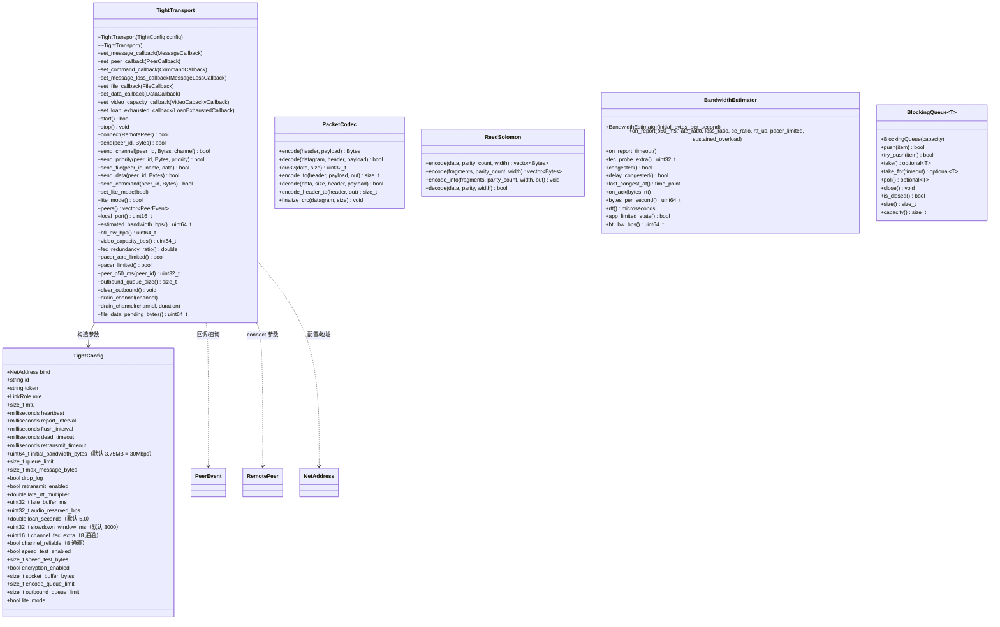
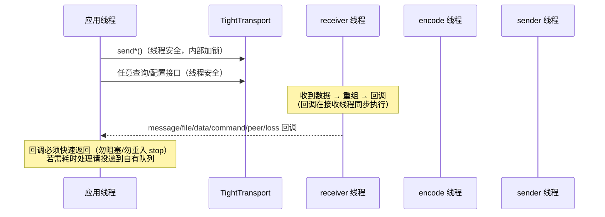

# tight — API 参考

tight 公共 API 全部位于 `include/tight/`，聚合头
`#include "tight/tight.hpp"` 即含主接口与全部类型。本文档按组件列出完整
API、语义、线程安全约束与回调契约。

## 目录

- [1. 公共 API 总览](#1-公共-api-总览)
- [2. TightTransport 主接口](#2-tighttransport-主接口)
- [3. TightConfig 配置](#3-tightconfig-配置)
- [4. 类型定义](#4-类型定义)
- [5. 回调与线程安全](#5-回调与线程安全)
- [6. 辅助组件](#6-辅助组件)
  - [6.1 ReedSolomon（fec.hpp）](#61-reedsolomonfechpp)
  - [6.2 BandwidthEstimator（bandwidth.hpp）](#62-bandwidthestimatorbandwidthhpp)
  - [6.3 PacketCodec（packet_codec.hpp）](#63-packetcodecpacket_codec_hpp)
  - [6.4 BlockingQueue（blocking_queue.hpp）](#64-blockingqueueblocking_queuehpp)
  - [6.5 Logger（logger.hpp）](#65-loggerloggerhpp)
- [7. 内部组件（不对外暴露）](#7-内部组件不对外暴露)

---

## 1. 公共 API 总览



## 2. TightTransport 主接口

`class TightTransport`（`tight/tight.hpp`）——唯一面向应用的传输对象。
**不可拷贝/移动**（pimpl 封装 `Impl`）。

### 2.1 生命周期

| 方法 | 说明 |
|---|---|
| `explicit TightTransport(TightConfig config)` | 构造；绑定地址/端口在 `start()` 时才生效 |
| `~TightTransport()` | 自动发送 Bye 并停止所有线程（无需显式 stop） |
| `bool start()` | 创建 socket + 绑定 + 起线程；失败返回 false（WSA/绑定/地址解析） |
| `void stop()` | 发送 Bye、回收线程、关闭 socket（幂等） |

### 2.2 连接

| 方法 | 说明 |
|---|---|
| `bool connect(const RemotePeer& remote)` | 登记对端并进入 Handshake 状态，立即发握手；`RemotePeer{id, NetAddress}` |

> 服务器（Node）无需 connect：收到任意来源报文时按地址自动建 peer
> （`anon-<port>-<rand>` 临时身份，握手后替换为对方 id）。

### 2.3 发送

| 方法 | 说明 | 返回 false 条件 |
|---|---|---|
| `bool send(peer_id, Bytes)` | 数据消息，通道 0，优先级 0 | 未 start / 队列满 / 超 `max_message_bytes` |
| `bool send_channel(peer_id, Bytes, uint8_t channel)` | 发送到指定逻辑通道 0..7 | 同上 |
| `bool send_priority(peer_id, Bytes, int priority)` | 高优先级先出队（音频不被文件流阻塞） | 同上 |
| `bool send_file(peer_id, name, Bytes data)` | 文件通道（=2）：先 manifest 后分块（60KB/块），块级 NACK 重传 + 去重；接收端完整重组后经 `set_file_callback` 交付 | name > 65535 / 队列背压 |
| `bool send_data(peer_id, Bytes)` | 可靠数据通道（=3）：消息级去重 only-once，接收端经 `set_data_callback` 交付 | 队列背压 |
| `bool send_command(peer_id, Bytes)` | 命令通道：单报文（≤ mtu−48）、保序、插队直发 | 未 Online/Established / 超单包载荷 |

file/data 通道使用前需配置 `cfg.channel_reliable[2]=true` / `[3]=true`
（两端一致），否则退化为普通通道语义。

### 2.4 回调注册

| 方法 | 触发时机 |
|---|---|
| `set_message_callback(MessageCallback)` | 通用数据消息重组完成（file/data 内部消息除外） |
| `set_peer_callback(PeerCallback)` | 对端状态变化：Established / Online / Closed |
| `set_command_callback(CommandCallback)` | 命令通道按序投递 |
| `set_message_loss_callback(MessageLossCallback)` | 消息重组失败（FEC 无法恢复）——视频丢帧通知，携带通道号 |
| `set_file_callback(FileCallback)` | 文件完整接收：`(peer_id, name, data)` |
| `set_data_callback(DataCallback)` | 可靠数据消息（去重后） |
| `set_video_capacity_callback(VideoCapacityCallback)` | **视频可用码率通知**（bps）：`video_capacity_bps()` 变化 >10% 且 >100kbps 时由**专用通知线程**回调（须快速返回，只做存储/编码器调整） |
| `set_loan_exhausted_callback(LoanExhaustedCallback)` | **令牌贷款耗尽/恢复通知**（sender 线程调用）：`exhausted=true` = 共享令牌桶（视频+file/data）贷款超限（btl×`loan_seconds`），视频被持续排空至债务清零——应用应停止推流/降码率；`false` = 债务清零、发送恢复——应用重启编码器（新 IDR 关键帧 + 低码率）快速恢复画面 |

### 2.5 运行模式

| 方法 | 说明 |
|---|---|
| `void set_lite_mode(bool lite)` | 运行时切换线程模型（本端属性）：true = 单线程 64KB 小栈（码率通知线程共用）；start() 前后均可 |
| `bool lite_mode() const` | 当前模式 |

### 2.6 查询与诊断

| 方法 | 说明 |
|---|---|
| `std::vector<PeerEvent> peers() const` | 当前对端快照 |
| `std::uint16_t local_port() const` | 实际绑定端口（bind 端口 0 时有用） |
| `std::uint64_t estimated_bandwidth_bps() const` | 当前限速值 = btl |
| `std::uint64_t btl_bw_bps() const` | AIMD 估计的 btl（bytes/s） |
| `std::uint64_t video_capacity_bps() const` | **视频可用码率**（bps）：`(btl×8 − 音频预留 − file/data 实时速率) / (1 + FEC冗余率)`，轮询版 |
| `double fec_redundancy_ratio() const` | 实际 FEC 冗余率（校验片/数据片，滑动窗口 1s，全部 peer 累计比） |
| `bool pacer_app_limited() const` | 应用受限状态（AIMD 不依赖投递率，恒不更新，保留诊断） |
| `bool pacer_limited() const` | 令牌桶真实积压标志（上一报告周期；AIMD 据此否决拥塞判定） |
| `std::uint32_t peer_p50_ms(peer_id) const` | 对端上报的单程延迟中位数（ms，0 = 无样本）；AIMD delay-based 信号源 |
| `std::size_t outbound_queue_size() const` | 出站积压数据报总数（send+encode+outbound 队列），本地即时拥塞信号 |
| `void clear_outbound()` | 清空数据面积压（**保留音频**：priority≥1 与 channel=1 的编码任务回退）；配合视频 force_keyframe 止损 |
| `void drain_channel(uint8_t channel)` | **按通道排空**（默认 100ms）：排空期内该通道数据报在 send/encode/outbound 三层出队即丢（不清队列），其他通道不受影响；期满自动恢复 |
| `void drain_channel(uint8_t channel, std::chrono::milliseconds duration)` | 显式指定排空时长 |
| `std::uint64_t file_data_pending_bytes() const` | file/data 通道待发负载（字节），供带宽预算（有负载时视频让出一半 btl） |

## 3. TightConfig 配置

完整字段与默认值见下表（`tight/types.hpp`）。自动钳制规则：`max_message_bytes`
→ [8KB, 10MB]；lite 模式下 `queue_limit≤128`、`encode_queue_limit≤64`、
`outbound_queue_limit≤256`、`socket_buffer_bytes≤16KB`、`flush_interval≥10ms`、
`drop_log` 强制关闭。

| 字段 | 默认值 | 说明 |
|---|---|---|
| `bind` | — | 绑定地址；端口 0 = 系统分配 |
| `id` | — | 本端标识（握手交换）；空 = 匿名 |
| `token` | — | 接入令牌（握手校验，两端一致） |
| `role` | Leaf | Node = 服务器；Leaf = 终端设备 |
| `mtu` | 1350 | 单包载荷 = mtu−48（加密再 −16 = 1286B） |
| `heartbeat` | 5s | 心跳 + 时钟重对表 |
| `report_interval` | 1s | ACK/NACK/迟到率/投递率上报周期 |
| `flush_interval` | 10ms | 排空节拍（lite 钳制 ≥10ms） |
| `dead_timeout` | 30s | 对端静默判定死亡 |
| `retransmit_timeout` | 500ms | 握手重传退避起步值 |
| `initial_bandwidth_bytes` | **3.75MB（30Mbps）** | AIMD 初始 btl 与**提升上限**（种子）；弱网下由报告量化收敛 |
| `queue_limit` | 65536 | 发送队列消息数上限 |
| `max_message_bytes` | 64KB | 单消息上限（钳制 [8KB, 10MB]） |
| `drop_log` | true | 异常消息丢弃告警（lite 强制关闭） |
| `retransmit_enabled` | true | 数据面 NACK 重传总开关（握手通告，任一端可单方面关闭） |
| `late_rtt_multiplier` | 4.0 | 迟到线 = 该倍数 × RTT（未开 late_buffer_ms 时） |
| `late_buffer_ms` | 0 | 迟到线 = P50 + 该值（视频 16ms）；0 = 用 RTT 倍数 |
| `audio_reserved_bps` | 0 | 音频编码码率（bps）：`video_capacity_bps` 计算时先扣除（校验片按 `channel_fec_extra[1]` 自动叠加：预留 = 值 × (1+extra)） |
| `loan_seconds` | 5.0 | 令牌贷款时间窗（秒）：共享令牌桶（视频+file/data）允许视频透支的额度 = btl×loan_seconds（覆盖编码联动延迟 1~2s）；超限 → 清空视频队列 + 持续排空至债务清零 + `LoanExhaustedCallback(true)`；0 = 禁用贷款（视频严格令牌） |
| `slowdown_window_ms` | 3000 | **拥塞排空窗口**（ms）：btl 量化大降（剧烈档 strength≥5%，×0.45 及以下）后，窗口内 `video_capacity_bps` 输出排空码率（btl 快照 − 超发积压 Q×8/窗口，3s 内排完）——应用编码码率骤降 → 发送骤减 → 积压排空 → CE 早停（排空期 btl 连降轮数少、不崩底）；窗口结束自动恢复；0 = 禁用 |
| `channel_fec_extra[8]` | 全 0 | 每通道额外 FEC 校验片（音频通道可单独加强） |
| `channel_reliable[8]` | 全 false | per-channel ARQ 开关（file/data 通道须为 true） |
| `speed_test_enabled` | true | 建连后发探测列车 |
| `speed_test_bytes` | 100KB | 探测列车长度 |
| `encryption_enabled` | true | X25519 + AES-256-GCM |
| `socket_buffer_bytes` | 8MB | SO_RCVBUF/SO_SNDBUF |
| `encode_queue_limit` | 4096 | 待分片消息队列 |
| `outbound_queue_limit` | 65536 | 待发数据报队列 |
| `lite_mode` | false | 客户端精简模式 |

## 4. 类型定义

### 4.1 枚举

| 类型 | 取值 |
|---|---|
| `PacketType` | Handshake=0, HandshakeAck=1, Online=2, Heartbeat=3, Bye=4, Data=5, Parity=6, Ack=7, Report=8, Probe=9, Command=10 |
| `LinkRole` | Leaf=0, Node=1 |
| `LinkState` | Closed=0, Handshake=1, Established=2, Online=3 |

### 4.2 结构体

```cpp
struct NetAddress { std::string host; std::uint16_t port; };

struct RemotePeer { std::string id; NetAddress address; };

struct PeerEvent {
    std::string   id;
    LinkRole      role;
    LinkState     state;
    std::uint32_t client_id;
};

struct PacketHeader {  // 48B 线格式头（见 design.md §3.1）
    std::uint32_t magic, client_id, sequence, acknowledgment, message_id, tick, checksum;
    std::uint8_t  version;
    PacketType    type;
    std::uint16_t flags, fragment_index, fragment_count, payload_size, reserved;
    std::uint64_t session_id;
};

using Bytes = std::vector<std::uint8_t>;
```

### 4.3 回调签名

```cpp
using MessageCallback = std::function<void(const std::string& peer_id, Bytes payload)>;
using PeerCallback    = std::function<void(const PeerEvent& event)>;
using CommandCallback = std::function<void(const std::string& peer_id, Bytes payload)>;
using MessageLossCallback = std::function<void(const std::string& peer_id, std::uint8_t channel)>;
using FileCallback = std::function<void(const std::string& peer_id,
                                        const std::string& name, Bytes data)>;
using DataCallback = std::function<void(const std::string& peer_id, Bytes data)>;
using VideoCapacityCallback = std::function<void(std::uint64_t bps)>;  // 视频可用码率（bps）
using LoanExhaustedCallback = std::function<void(bool exhausted)>;     // 令牌贷款耗尽/恢复
```

## 5. 回调与线程安全



- **所有公共方法线程安全**：发送/查询/配置可在任意线程调用；
- **回调执行线程**：接收类回调在 receiver 线程（lite = reactor 线程）
  同步执行，`send*` 不会触发死锁（发送侧锁粒度短且不持锁回调）；
- 回调内**禁止**调用 `stop()` 或销毁对象；耗时逻辑应转入应用侧线程。

## 6. 辅助组件

### 6.1 ReedSolomon（fec.hpp）

GF(2⁸) Reed-Solomon 擦除码，可独立使用：

```cpp
struct ReedSolomon {
    struct Span { const std::uint8_t* data; std::size_t size; };  // 零拷贝区间

    static std::vector<Bytes> encode(const std::vector<Bytes>& data,
                                     std::size_t parity_count, std::size_t width);
    static std::vector<Bytes> encode(const std::vector<Span>& fragments,
                                     std::size_t parity_count, std::size_t width);
    static void encode_into(const std::vector<Span>& fragments,
                            std::size_t parity_count, std::size_t width,
                            std::vector<Bytes>& out);   // 复用缓冲，热点零堆分配
    static bool decode(std::vector<std::optional<Bytes>>& data,   // nullopt = 缺失
                       const std::vector<std::pair<std::size_t, Bytes>>& parity,  // (校验片索引, 内容)
                       std::size_t width);             // 缺失数 ≤ 校验数时全部恢复
};
```

语义：不足 width 的尾部分片按零处理；恢复分片长度均为 width，真实长度由
调用方（流内 4 字节总长前缀）裁剪。

### 6.2 BandwidthEstimator（bandwidth.hpp）

三信号 AIMD 拥塞估计器（GCC 风格），可独立使用（内部互斥锁保护）：

| 方法 | 语义 |
|---|---|
| `BandwidthEstimator(uint64_t initial_bps)` | 初始 btl 与**提升上限种子**（下限 kMinBtlBps=12500 = 100kbps） |
| `on_report(p50_ms, late_ratio, loss_ratio, ce_ratio, rtt_us, pacer_limited, sustained_overload)` | 每报告周期调用（带迟滞与突刺门控）：**`sustained_overload=false`（报告期平均发送 ≤ 对端接收速率，关键帧突刺）时不降速**（btl 保持，避免 I 帧排队把 btl 打崩）；持续超发才按强度量化降速——strength = max(late, ce)（令牌受限时 max(loss, ce)）：≥50% → ×0.20、≥20% → ×0.30、≥5% → ×0.45、≥1% → ×0.65、仅 delay 信号 → ×0.65；恢复 = 延迟<10ms 且迟到率<0.5%（或令牌受限时丢包率<0.5% 且 CE<1%）→ 两步台阶 ×1.5（提升上限 = 种子，连续爬升；CE 活跃跳过 FEC 探测）；中间区保持不动 |
| `fec_probe_extra()` | 当前 FEC 探测冗余片数（恢复台阶 1 且无 CE 时 = 2，台阶 2 移除；fragmenter 据此追加校验片，仅视频通道） |
| `congested()` | 最近一次报告判定的拥塞状态（信号级，与是否降速无关） |
| `delay_congested()` | 排队型拥塞（排队延迟 EWMA > 20ms）专用判定——排队型拥塞冗余加剧排队，丢包型拥塞（随机丢包）冗余有效对抗丢包，不能一并关闭 |
| `last_congest_at()` | 最近一次**剧烈降速**时刻（量化阶梯 ×0.45 及以下档，strength≥5%）；transport 据此判定排空窗口（`slowdown_window_ms`）；无效 time_point = 未剧烈降速过 |
| `on_report_timeout()` | **报告停滞降速**：对端 Report 连续 3×report_interval 未到达（链路严重卡顿/断流）时由 transport 调用——btl ×= 0.5 单次降（下限 100kbps）、重置恢复台阶与 FEC 探测；**one-shot**（m_report_stall 标志，同段停滞不叠加），报告恢复到达时自动清除、恢复台阶 ×1.5 自然回升 |
| `on_ack(bytes, rtt)` | 只维护平滑 RTT（bytes 忽略：投递率不再参与估计） |
| `bytes_per_second()` | 限速值 = max(floor=1KB/s, btl) |
| `rtt()` / `btl_bw_bps()` / `app_limited_state()` | 诊断（app_limited 恒不更新，保留） |

### 6.3 PacketCodec（packet_codec.hpp）

```cpp
class PacketCodec {
public:
    static Bytes encode(const PacketHeader& header, const Bytes& payload);
    static bool  decode(const Bytes& datagram, PacketHeader& header, Bytes& payload);
    static std::uint32_t crc32(const std::uint8_t* data, std::size_t size);
    // 零堆分配变体：
    static std::size_t encode_to(const PacketHeader&, const Bytes&, std::uint8_t* out);
    static bool decode(const std::uint8_t* data, std::size_t size,
                       PacketHeader& header, Bytes& payload);
    // 单缓冲构建：先写头（CRC 置零），装配后 finalize_crc 一次定稿
    static std::size_t encode_header_to(const PacketHeader&, std::uint8_t* out);
    static void finalize_crc(std::uint8_t* datagram, std::size_t size);
};
```

decode 校验 magic/version/长度/CRC，任何不一致返回 false。CRC 为
IEEE 802.3，头部 44B + 负载流式计算。

### 6.4 BlockingQueue（blocking_queue.hpp）

有界阻塞队列（单链表 + 节点回收池，排空后不保留内部块）：

| 方法 | 语义 |
|---|---|
| `push(item)` | 满则阻塞等待；close 后返回 false |
| `try_push(item)` | 满/关闭立即 false |
| `take()` | 空则阻塞；close 且空返回 nullopt |
| `take_for(timeout)` | 带超时出队 |
| `poll()` | 非阻塞出队 |
| `close()` / `is_closed()` / `size()` / `capacity()` | 生命周期与查询（capacity=0 无界） |

### 6.5 Logger（logger.hpp）

```cpp
tight::Logger::instance().set_level(tight::LogLevel::Warn);
TIGHT_LOG_DEBUG(msg) / TIGHT_LOG_INFO(msg) / TIGHT_LOG_WARN(msg) / TIGHT_LOG_ERROR(msg)
```

单例、线程安全，输出到 stderr（含时间戳与级别）。

## 7. 内部组件（不对外暴露）

`src/` 下实现组件（命名空间 `tight::tight_detail`）仅供测试直连，不作为
稳定 API：`Peer`（每对端状态）、`Reassembler`、`Fragmenter`、`Report`、
`CommandChannel`、`crypto`（X25519/SHA-256/HKDF/AES-256-GCM）、`crc32`、
`address`、`buffer_pool`、`wire_format`、`ecn_platform`、`wsa`。

---

> 配套文档：[功能总结](tight_overview.md) · [架构](tight_architecture.md) ·
> [设计](tight_design.md) · [使用](usage.md) · [lite 模式文档集](litemode/README.md)
