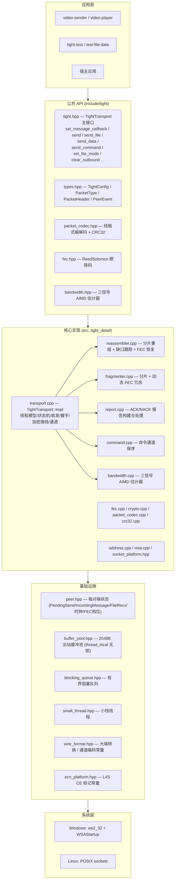
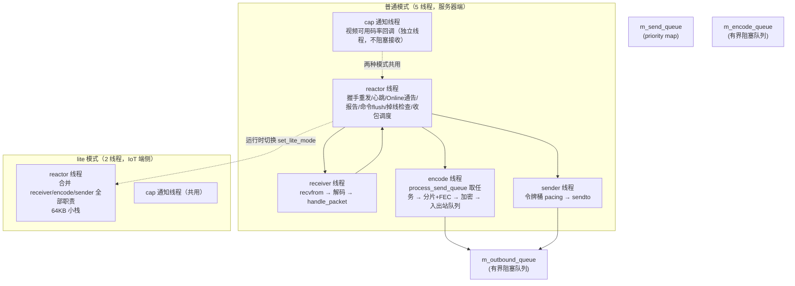
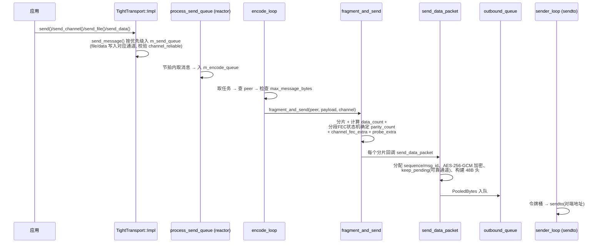
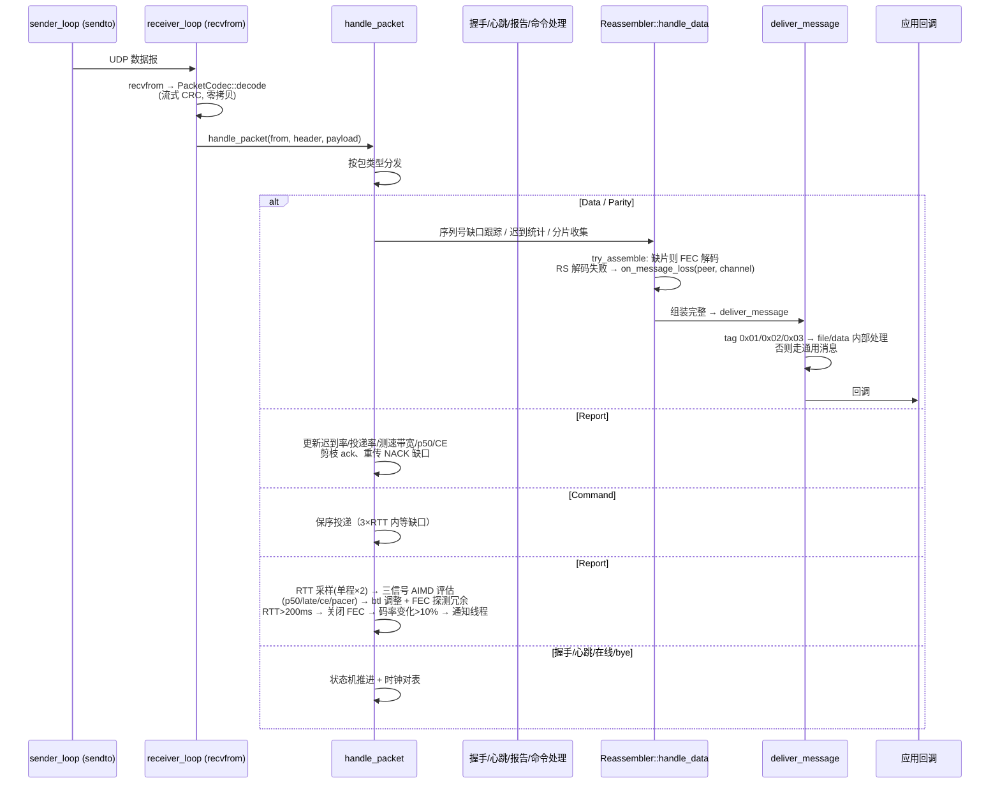
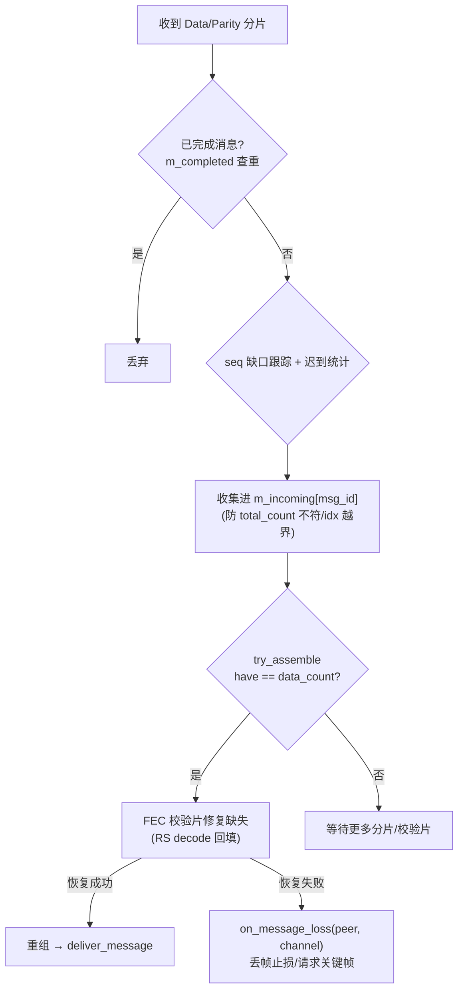
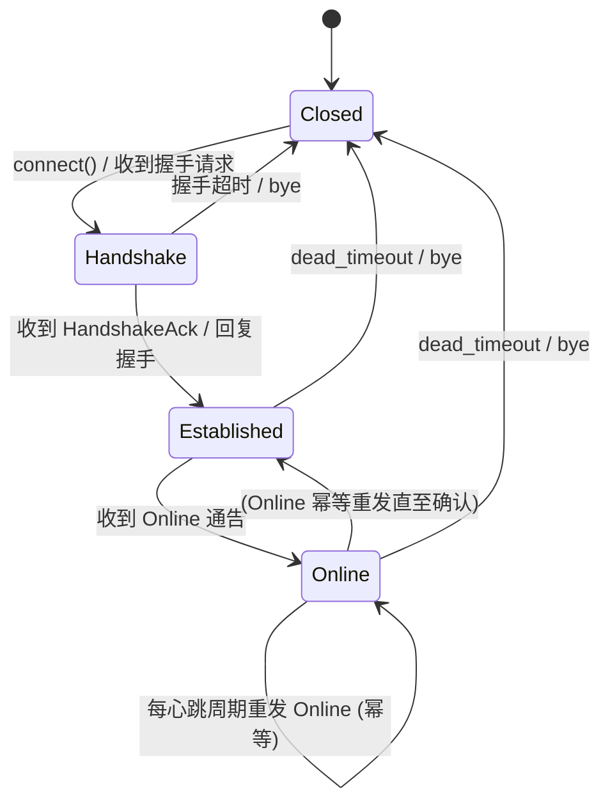
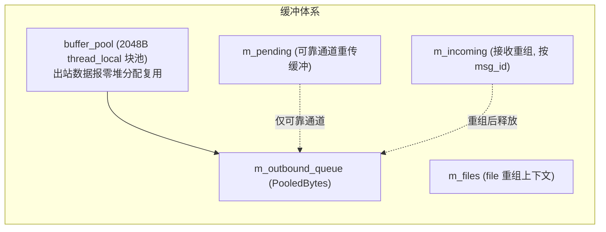

# tight — 架构总结

tight 的分层架构、线程模型、模块划分与核心数据流。实现主体在 `src/`（命名空间 `tight::tight_detail`），公共 API 在 `include/tight/`。
设计决策与权衡见 [tight_design.md](tight_design.md)，完整 API 见 [api_reference.md](api_reference.md)。

## 1. 分层架构

## 2. 模块职责

| 模块 | 职责 |
| --- | --- |
| `transport.cpp` | 唯一入口 `TightTransport::Impl`：线程编排、Peer 状态机、握手/心跳/保活、加密接线、file/data 通道、令牌桶、视频码率通知（`video_capacity_bps`）、按通道排空（`drain_channel`）、诊断接口 |
| `reassembler.cpp` | 接收路径：sequence 缺口跟踪、分片收集、FEC 解码恢复、消息投递、丢帧通知（`on_message_loss`） |
| `fragmenter.cpp` | 发送路径：消息分片、RS 校验片生成、分段 FEC 状态机（stage 0/1/2）、FEC 关闭（RTT>200ms）、实际冗余率统计 |
| `report.cpp` | 周期报告：ack 游标、迟到率、丢失序号、测速带宽、投递率、丢包率、p50、CE 占比；处理端：重传 + ack 剪枝 |
| `command.cpp` | 命令通道：单报文、保序插队、乱序最多等 3×RTT 后跳号 |
| `bandwidth.cpp` | **三信号 AIMD 估计器**：delay-based（排队延迟 = P50−RTprop EWMA）+ late-based（迟到率）+ pacer 否决；拥塞 ×0.5、恢复两步台阶 ×1.5、下限 100kbps、FEC 探测冗余输出 |
| `crypto.cpp` | X25519 / SHA-256 / HKDF / AES-256-GCM（纯 C++ 内置实现） |
| `fec.cpp` | Reed-Solomon GF(2⁸) Vandermonde 编码 / 高斯消元解码 |
| `packet_codec.cpp` | 48B 头编解码 + 流式 CRC 校验（零堆分配变体） |

## 3. 线程模型

### 3.1 线程分工

| 线程 | 职责 |
| --- | --- |
| reactor | 周期节拍：握手重发退避（500ms 起步、封顶 5s）、心跳、Online 幂等重发、报告发送（333ms/1s）、命令 flush、dead_timeout 掉线检查、`handle_packet` 分发 |
| receiver | 独占 `recvfrom`，保证收包不被发送阻塞；CE 标记报文计数并计入迟到统计 |
| encode | 独占 CPU 密集的 FEC 编码 + 加密，reactor 保持空闲处理收包 |
| sender | 独占 `sendto`，令牌桶背压不阻塞 reactor/encode |
| cap 通知 | 消费 `m_cap_queue`（容量 4），以独立线程调 `VideoCapacityCallback`（应用回调须快速返回） |

设计原则：**单生产者多消费者**的出站队列 —— reactor/encode 只入队，sender 只出队并 `sendto`，任何 socket 阻塞都不影响协议核心。

### 3.2 lite 模式

- reactor 合并全部职责，receiver/encode/sender 线程被 join 回收（cap 通知线程两种模式共用）；
- 队列容量收紧：`encode≤64`、`outbound≤256`、`queue_limit≤128`、socket≤16KB；
- `flush_interval` 钳制 ≥10ms（省 CPU 唤醒），`drop_log` 强制关闭（静默丢弃）；
- `set_lite_mode()` 运行时切换：先让 reactor 接管再回收线程（反之先清空 `m_lite_pending`）。

## 4. 发送数据流

### 4.1 关键点

- **sequence 与 message_id 分离**：数据序列号 `m_sequence_out` 与消息组 id `m_msg_id_out` 独立计数器，避免对端缺口跟踪出现"幽灵序号"导致 ack 冻结；
- **可靠通道**（`channel_reliable`）：分片保留在 `m_pending` 供 NACK 重传，缺口由对端上报；
- **FEC 探测冗余**：AIMD 恢复台阶第一步时 `fec_probe_extra()` 追加 2 片校验（仅通道 0）压上负载感知链路，第二步确认后移除（业务替换）；
- **FEC 关闭**：平滑 RTT >200ms（长距离/重拥塞）→ `peer.m_fec_disable` 置位，fragmenter 校验片全部归零让出带宽，回落自动恢复；
- **通道排空**（`drain_channel`）：排空期内该通道数据报在 send_queue / encode 队列 / outbound 队列三层出队即丢（不清队列），音频/文件通道不受影响；
- **带宽预算**：`video_capacity_bps = (btl×8 − audio_reserved_bps×(1+channel_fec_extra[1]) − file/data 实时速率) / (1 + 实际FEC冗余率)`，变化 >10% 且 >100kbps 经 cap 通知线程回调；
- **止损**：`outbound_queue_size()>3000` 或 sendFail 1s≥5 → `clear_outbound()`（保留音频）+ 应用侧 force_keyframe + `set_bitrate(500k)`（冷却 2s）。

## 5. 接收数据流

### 5.1 reassembler 内部

## 6. Peer 状态机

- **握手重发退避**：500ms 起步、封顶 5s，进入 Handshake 状态时重置；
- **Online 幂等重发**：Established/Online 状态下按心跳周期重发（避免单次 Online 丢包导致对端应用层状态永久停在 Established）；
- **时钟对表**：握手时估 offset = `(remote_tick - local_arrival) - rtt/2`，之后每次心跳再同步漂移。

## 7. 内存与缓冲

| 场景 | 内存档案 |
| --- | --- |
| 普通模式空闲 | ~460KB |
| lite 模式空闲 | ~76KB |
| lite 无重传在途 | 常数 ~24KB（与码率无关） |
| lite 有重传在途 | ∝ 码率 × 确认窗口，队列封顶最坏 ~5.4MB |
