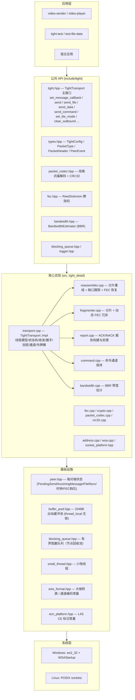
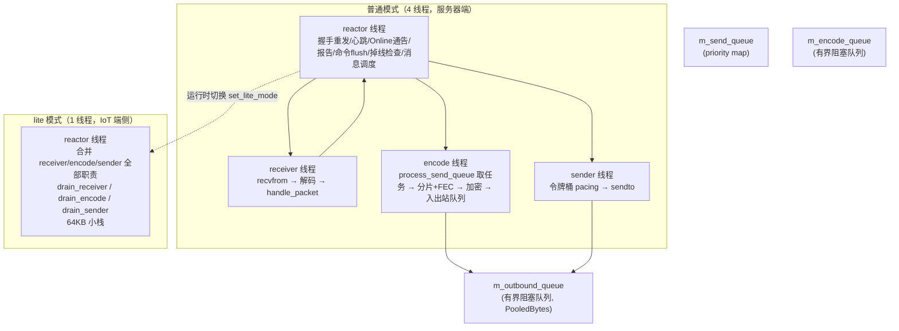
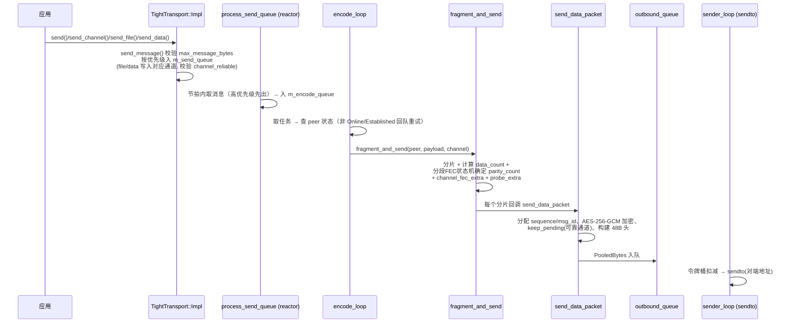
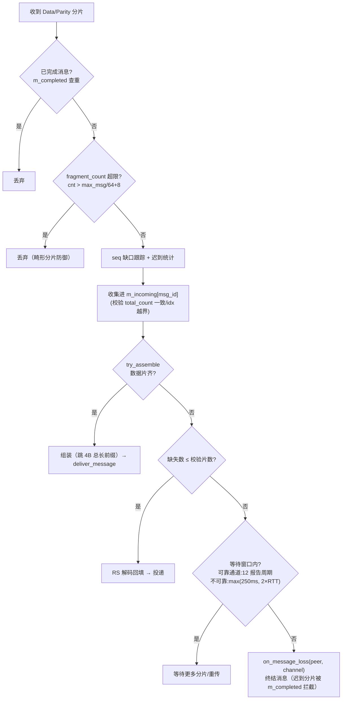
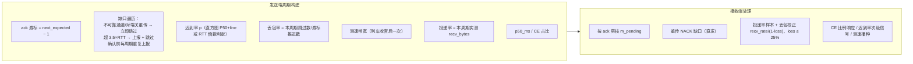
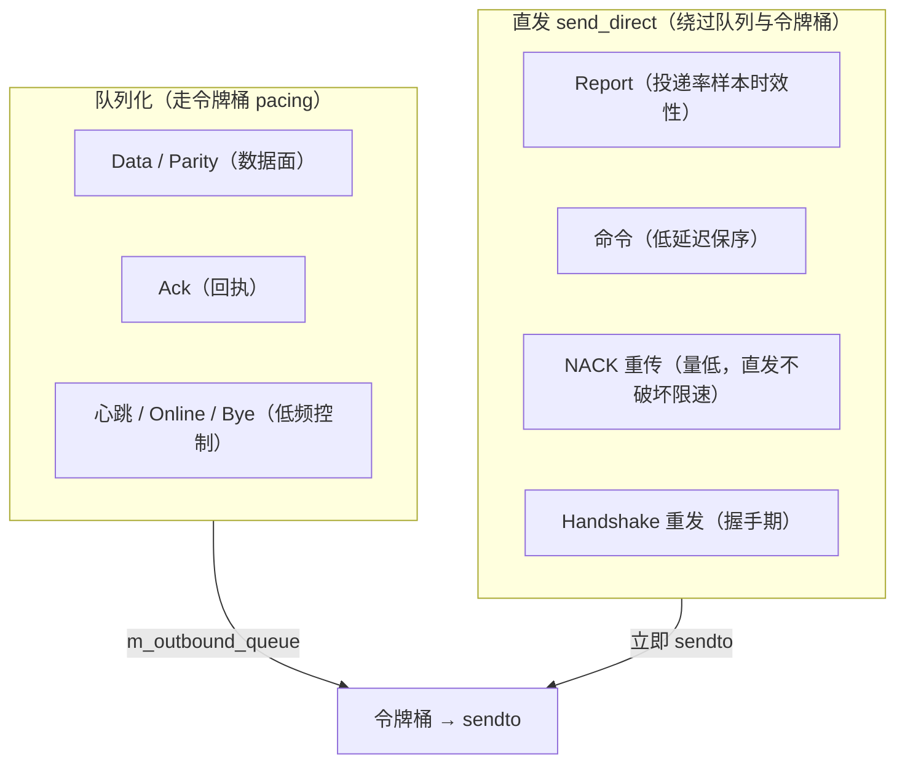
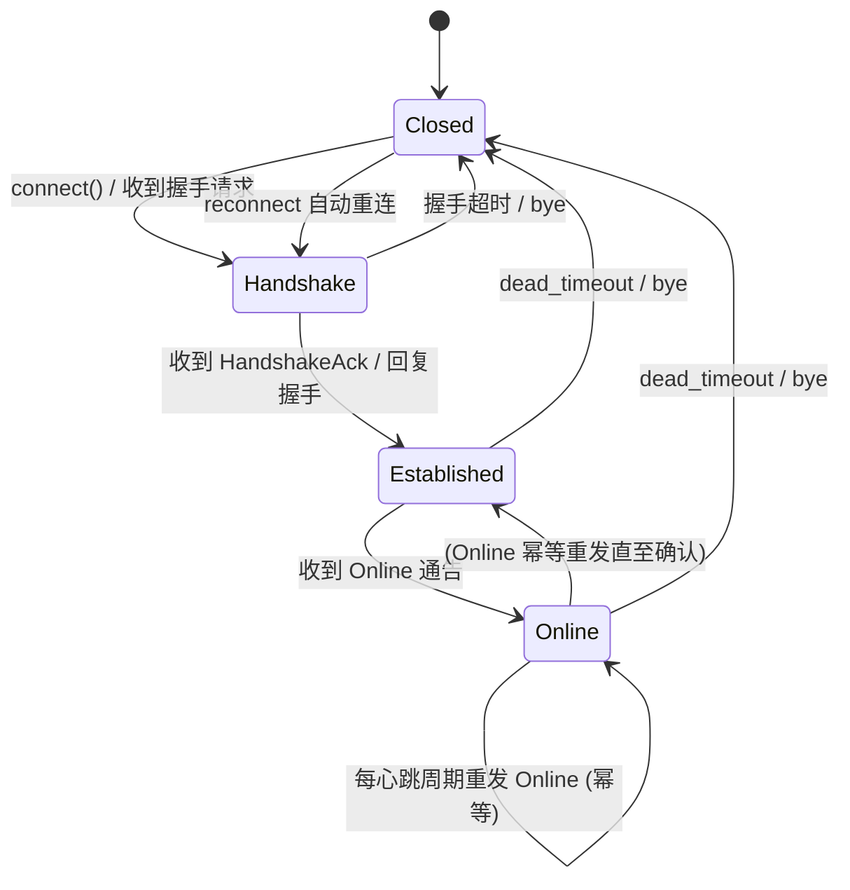
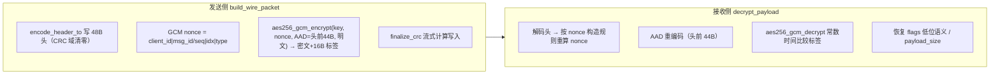
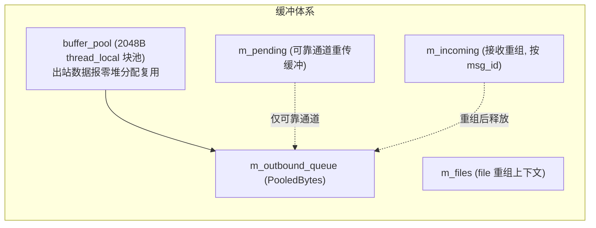

# tight — 架构文档

tight 的分层架构、线程模型、模块划分与核心数据流。实现主体在 `src/`
（命名空间 `tight::tight_detail`），公共 API 在 `include/tight/`。
设计决策与权衡见 [tight_design.md](tight_design.md)，完整 API 见
[api_reference.md](api_reference.md)。

## 目录

- [1. 分层架构](#1-分层架构)
- [2. 模块职责](#2-模块职责)
- [3. 线程模型](#3-线程模型)
- [4. 发送数据流](#4-发送数据流)
- [5. 接收数据流](#5-接收数据流)
- [6. 出站报文分类：队列化 vs 直发](#6-出站报文分类队列化-vs-直发)
- [7. Peer 状态机](#7-peer-状态机)
- [8. 加密路径](#8-加密路径)
- [9. 内存与缓冲](#9-内存与缓冲)

---

## 1. 分层架构

## 2. 模块职责

| 模块 | 职责 |
| --- | --- |
| `transport.cpp` | 唯一入口 `TightTransport::Impl`：线程编排、Peer 状态机、握手/心跳/保活、加密接线、file/data 通道、令牌桶 pacing、诊断接口 |
| `reassembler.cpp` | 接收路径：sequence 缺口跟踪、分片收集、FEC 解码恢复、消息投递、丢帧通知（`on_message_loss`） |
| `fragmenter.cpp` | 发送路径：消息分片、RS 校验片生成、分段 FEC 状态机（stage 0/1/2） |
| `report.cpp` | 周期报告：ack 游标、迟到率、丢失序号、测速带宽、投递率、丢包率、p50、CE 占比；处理端：重传 + ack 剪枝 |
| `command.cpp` | 命令通道：单报文、保序插队、乱序最多等 3×RTT 后跳号 |
| `bandwidth.cpp` | BBR 估计器：BtlBw max filter、RTprop、增益时间片、app/pacer limited、CE/FEC 探测 |
| `crypto.cpp` | X25519 / SHA-256 / HKDF / AES-256-GCM（纯 C++ 内置实现） |
| `fec.cpp` | Reed-Solomon GF(2⁸) Vandermonde 编码 / 高斯消元解码 |
| `packet_codec.cpp` | 48B 头编解码 + 流式 CRC 校验（零堆分配变体） |
| `address.cpp` | IPv4 地址解析（数字 / localhost / DNS） |
| `crc32.cpp` | IEEE 802.3 CRC-32（表驱动 + 流式更新） |
| `wsa.cpp` | Windows WSAStartup 生命周期管理 |

## 3. 线程模型

### 3.1 线程分工

| 线程 | 职责 |
| --- | --- |
| reactor | 周期节拍（flush_interval）：握手重发退避（500ms 起步、封顶 5s）、心跳（含 RTT 回显）、Online 幂等重发、报告发送（report_interval）、命令 flush、dead_timeout 掉线检查 + 过期重组清理、`process_send_queue` 消息调度 |
| receiver | 独占 `recvfrom`（非阻塞 + 500µs 退避），保证收包不被发送阻塞；CE 标记报文直接计数不解析 |
| encode | 独占 CPU 密集的 FEC 编码 + AES-256-GCM 加密，reactor 保持空闲处理收包 |
| sender | 独占 `sendto`，令牌桶背压不阻塞 reactor/encode |

设计原则：**单生产者多消费者**的出站队列 —— reactor/encode 只入队，
sender 只出队并 `sendto`，任何 socket 阻塞都不影响协议核心。lite 模式下
reactor 每节拍内限额消费（收 ≤64 / 编码 ≤16 / 发 ≤64 报文），令牌不足时
保留当前报文到下一节拍，不阻塞。

### 3.2 app_limited / pacer_limited 判定（发送侧）

- **app_limited**：出站队列 ≤1 且最近 500ms 无应用数据发送（`m_last_app_send_ms`）
  才视为应用受限——持续流（如视频 30fps）的帧间空隙短暂为空**不算**，
  否则投递率样本被当作应用速率、btl 卡死；
- **pacer_limited**：令牌桶因真实积压（≥32 个数据报排队）而卡住时置位，
  仅用于排空片门控（探测片真建过队列才排空），不用于拒绝投递率样本。

### 3.3 lite 模式

- reactor 合并全部职责，receiver/encode/sender 线程被 join 回收；
- 队列容量收紧：`encode≤64`、`outbound≤256`、`queue_limit≤128`、socket≤16KB；
- `flush_interval` 钳制 ≥10ms（省 CPU 唤醒），`drop_log` 强制关闭（静默丢弃）；
- `set_lite_mode()` 运行时切换：切 lite 先让 reactor 接管再回收线程；
  切普通先清 `m_lite_pending` 再启动工作线程，队列容量按构造时配置固定。

## 4. 发送数据流

### 4.1 关键点

- **sequence 与 message_id 分离**：数据序列号 `m_sequence_out` 与消息组 id
  `m_msg_id_out` 独立计数器（控制包序列 `m_control_seq_out`、命令序列
  `m_cmd_seq_out` 也各自独立），避免对端缺口跟踪出现"幽灵序号"导致
  ack 冻结、m_pending 无限堆积；
- **Parity 分片 seq=0**：不参与缺口跟踪（校验片丢失无需重传），且不会
  抢先初始化接收端序列基准；
- **可靠通道**（`channel_reliable`）：分片保留在 `m_pending` 供 NACK 重传，
  缺口由对端上报；保留条件 = 本端配置 && 对端握手通告
  （`peer->m_peer_retransmit`）；
- **带宽预算**：视频发送端检测 `file_data_pending_bytes()>0` 时码率减半
  （file+data 各让 25%）；
- **止损**：`outbound_queue_size()>3000` 或 sendFail 1s≥5 → `clear_outbound()`
  应用侧 force_keyframe + `set_bitrate(500k)`（冷却 2s）。

### 4.2 令牌桶

- 速率 = `BandwidthEstimator::bytes_per_second()`（BtlBw × 增益时间片），
  容量 cap = max(4×mtu, bps×0.02)（保底容纳一个节拍的实际时长，避免
  Windows ~15.6ms 睡眠粒度下 btl 追不上实际带宽）；
- app_limited 时令牌不足不阻塞（应用速率即上限）。

## 5. 接收数据流

```mermaid
sequenceDiagram
    participant SD as sender_loop (sendto)
    participant RC as receiver_loop (recvfrom)
    participant HP as handle_packet
    participant HS as 握手/心跳/报告/命令处理
    participant RS as Reassembler::handle_data
    participant DV as deliver_message
    participant CB as 应用回调

    SD->>RC: UDP 数据报
    RC->>RC: recvfrom → CE 标记计数 → PacketCodec::decode<br/>(流式 CRC, 零拷贝)
    RC->>HP: handle_packet(from, header, payload)
    HP->>HP: 按包类型分发（加密包先解密恢复 flags/payload_size）
    alt Data / Parity
        HP->>RS: 序列号缺口跟踪 / 迟到统计 / 分片收集
        RS->>RS: try_assemble: 缺片则 FEC 解码<br/>缺失超能力且超等待窗口 → on_message_loss(peer, channel)
        RS->>DV: 组装完整 → deliver_message
        DV->>DV: tag 0x01/0x02/0x03 → file/data 内部处理<br/>否则走通用消息
        DV->>CB: 回调
    else Report
        HP->>HP: RTT 采样(单程×2) → 更新迟到率/投递率/测速带宽/p50/CE<br/>剪枝 ack、重传 NACK 缺口（直发绕过令牌桶）
    else Command
        HP->>HP: 保序投递（3×RTT 内等缺口）
    else 握手/心跳/在线/bye
        HP->>HP: 状态机推进 + 时钟对表 + RTT 回显
    else Ack
        HP->>HP: 剪枝 m_pending + ACK RTT 采样 + 补做延迟握手对表
    else Probe
        HP->>HP: 测速列车字节/跨度累计（间隙 20ms 收官）
    end
```

### 5.1 reassembler 内部

- 分片数防御：`max_fragments = max_message_bytes / 64 + 8`，超限直接丢弃
  （防恶意 fragment_count 预分配耗尽内存），丢弃告警按 peer 每秒限频；
- 组装时按流内 4 字节大端总长前缀裁剪真实长度，并校验
  `total ≤ max_message_bytes`；
- 迟到统计：单程传输时间超迟到线（`late_rtt_multiplier×RTT` 或
  `P50 + late_buffer_ms`）计入迟到率，驱动发送端 FEC 冗余。

### 5.2 Report 构建与处理（report.cpp）

## 6. 出站报文分类：队列化 vs 直发

直发理由（`transport.cpp` 注释）：报告在反向洪泛时排队 ~7s 才到达对端，
投递率样本过期、btl 跟跌被拖延；重传量低（弱网 ~4%），直发不破坏链路
限速语义。

## 7. Peer 状态机

- **握手重发退避**：500ms 起步、指数翻倍、封顶 5s，进入 Handshake 状态时
  重置；重发前清除陈旧握手挂账（防 pending 非空永不重发死锁）；
- **Online 幂等重发**：Established/Online 状态下按心跳周期重发（弱网 20%
  丢包下单次 Online 丢失不会让对端应用层状态永久停在 Established）；
- **掉线检测**：`dead_timeout` 内未收到任何报文 → Closed；Leaf 侧
  `m_reconnect=true` 自动回到 Handshake 重连；
- **时钟对表**：握手时估 offset = `(remote_tick - local_arrival) - rtt/2`，
  之后每次心跳平滑再同步（offset×7+sample)/8 跟踪漂移。

## 8. 加密路径

- 会话密钥：`hkdf_sha256(X25519 共享秘密, salt=排序(client_id 各 4B),
  "tight-data-key-v1")`，双方独立派生出一致密钥；
- 加密可配置开关（`encryption_enabled`），关闭时数据面明文 + CRC 完整性；
- ECDH 低阶点检测：共享秘密全零则拒绝（`x25519` 返回 false）。

## 9. 内存与缓冲

| 场景 | 内存档案 |
| --- | --- |
| 普通模式空闲 | ~460KB |
| lite 模式空闲 | ~76KB |
| lite 无重传在途 | 常数 ~24KB（与码率无关） |
| lite 有重传在途 | ∝ 码率 × 确认窗口，队列封顶最坏 ~5.4MB |

周期清理：`m_incoming` / `m_completed` / `m_missing_seqs`（>4096 硬上限）
随 `check_offline` 与报告周期清理，弱网长时间运行不增长。

---

> 配套文档：[设计](tight_design.md) · [使用](usage.md) ·
> [API 参考](api_reference.md) · [功能总结](tight_overview.md) ·
> [lite 模式文档集](litemode/README.md)
