# tight — 协议设计文档

本文档记录 tight 可靠 UDP 协议栈的关键**设计决策与权衡**：线格式、会话
建立、可靠性机制、FEC 自适应、拥塞控制、时钟对表、命令保序、内存预算。
实现细节见 [tight_architecture.md](tight_architecture.md)，公共 API 见
[api_reference.md](api_reference.md)，完整使用见 [usage.md](usage.md)。

## 目录

- [1. 设计目标与约束](#1-设计目标与约束)
- [2. 总体设计](#2-总体设计)
- [3. 线格式设计](#3-线格式设计)
- [4. 会话建立与密钥协商](#4-会话建立与密钥协商)
- [5. 数据面可靠性设计](#5-数据面可靠性设计)
- [6. FEC 冗余自适应设计](#6-fec-冗余自适应设计)
- [7. 拥塞控制设计（三信号 AIMD）](#7-拥塞控制设计三信号-aimdgcc-风格)
- [8. 时钟对表与延迟统计](#8-时钟对表与延迟统计)
- [9. 命令通道保序设计](#9-命令通道保序设计)
- [10. 线程与内存设计](#10-线程与内存设计)
- [11. 关键设计决策索引](#11-关键设计决策索引)

---

## 1. 设计目标与约束

| 目标 | 约束 |
|---|---|
| 端云实时通信：IoT 设备 ↔ 云端网关 | 一端多并发服务器（Node），一端受限设备（Leaf），**同一份代码两种运行模式** |
| 零第三方依赖 | 仅系统 socket + 线程库；加密原语（X25519/SHA-256/HKDF/AES-256-GCM）为内置纯 C++ 实现 |
| 弱网可用 | 丢包重传 + 擦除码 + 拥塞控制分层兜底；重传可协商关闭（纯 FEC 低延迟路径） |
| 资源受限端侧 | lite 模式：单线程、64KB 小栈、空闲实例 ~76KB、队列容量自动收紧 |
| C++17 跨平台 | Windows（MinGW/MSVC）与 Linux（WSL） |

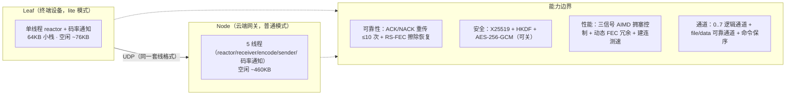

## 2. 总体设计

### 2.1 分层

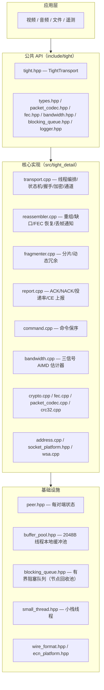

### 2.2 关键抽象：Peer

每个对端一份 `Peer` 状态（`src/peer.hpp`），持有该对端的全部协议状态：

| 状态组 | 字段 | 说明 |
|---|---|---|
| 链路 | `m_state` / `m_addr` / `m_role` / `m_reconnect` | 状态机、地址、角色、断线重连 |
| 序号 | `m_sequence_out` / `m_msg_id_out` / `m_control_seq_out` / `m_cmd_seq_out` | **四个独立计数器**，防止互相污染（见 5.2） |
| 发送 | `m_pending`（重传缓冲）/ `m_missing_seqs`（接收缺口）/ `m_recv_seqs` | ARQ 双侧状态 |
| 重组 | `m_incoming` / `m_completed` / `m_files` | 分片重组 + 消息去重 + 文件重组 |
| 时钟 | `m_clock_offset_us` / `m_clock_synced` | 对表（见第 8 节） |
| 统计 | `m_transit_samples` / `m_late_samples` / `m_latency_hist` / `m_recv_bytes` / `m_data_pkts` / `m_ce_marks` / `m_probe_*` | 报告期统计 |
| 命令 | `m_cmd_held` / `m_cmd_gap_since` / `m_cmd_next_expected` | 保序窗口 |
| 协商 | `m_retransmit` / `m_peer_retransmit` / `m_channel_reliable` | 重传能力与通道可靠位 |
| 加密 | `m_crypto_ready` / `m_crypto_key` | AES-256-GCM 会话密钥 |

## 3. 线格式设计

### 3.1 报文头（48 字节，全大端）

| 偏移 | 长度 | 字段 | 说明 |
|---|---|---|---|
| 0 | 4 | magic | `0x54474854`（"TGHT"） |
| 4 | 1 | version | 1 |
| 5 | 1 | type | 0=Handshake … 10=Command（见 types.hpp） |
| 6 | 2 | flags | bit15 = 密文标志；低位 = 数据分片数 data_cnt |
| 8 | 4 | client_id | 本端随机身份 |
| 12 | 8 | session_id | 会话随机数 |
| 20 | 4 | sequence | 数据面序号（Data 分片）或控制包序号 |
| 24 | 4 | acknowledgment | Ack 报文回执序号 |
| 28 | 4 | message_id | 消息组 id（分片共享） |
| 32 | 2 | fragment_index / fragment_count | 分片位置 / 总数（含校验片） |
| 36 | 2 | payload_size | 负载长度（密文时含 16B 标签） |
| 38 | 2 | reserved | 高 4 位 = 逻辑通道号，低 12 位 = real_size |
| 40 | 4 | tick | 发送端时钟（unix ms 低 32 位），时钟对表/单程延迟用 |
| 44 | 4 | checksum | CRC32（IEEE 802.3），流式计算，覆盖头 44B + 负载 |

设计要点：

- **CRC 域先置零再流式计算**：免拼接临时缓冲（`crc32_update` 分段喂入）；
- **通道号与 real_size 共享 reserved**：`channel << 12 | (real_size & 0x0FFF)`，
  默认 MTU 1350 时 real_size ≤ 1302，12 位安全；
- **加密只密负载、头始终明文**：解密前即可路由/去重/统计。

### 3.2 负载与加密（AES-256-GCM）

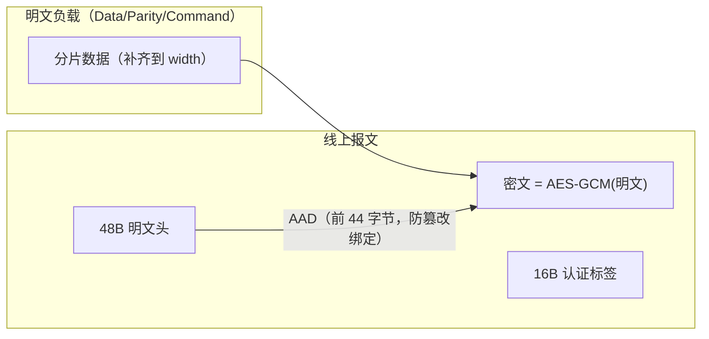

- **nonce（96 位）按报文内容构造**，保证同一会话内唯一：
  - Data/Parity：`client_id(4) | message_id(4) | fragment_index(2) | type(1) | 0(1)`
  - Command：`client_id(4) | sequence(4) | type(1) | 0(3)`
- **AAD = 报文头前 44 字节**（CRC 域除外），任何头字段被篡改都会导致认证失败；
- `kFlagEncrypted` 置位后 `payload_size` 为密文长度（明文 + 16），接收端解密后恢复。

### 3.3 握手载荷

```
[role(1)] [id_size(2)] [id] [token] [X25519 公钥(32，若开加密)] [能力标志(1)]
```

能力标志 bit0 = `retransmit_enabled` 通告。HandshakeAck 载荷为
`[X25519 公钥(32)?][能力标志(1)]`——仅凭 Ack 也可完成 ECDH 与重传协商
（双方同时 connect 时可能只收到对方 Ack 而收不到 Handshake）。

### 3.4 Report 载荷

```
[ack 游标(4)] [迟到率×10000(2)] [丢失序号数 N(2)] [reserved(4)]
[丢失序号列表(4N, N≤256)]
[probe_bw(4)] [recv_rate(4)] [loss_ratio(2)] [ce_ratio(2)] [p50_ms(2)]
```

尾部可选字段按 size 判定存在性，旧读端忽略尾部、向后兼容。

## 4. 会话建立与密钥协商

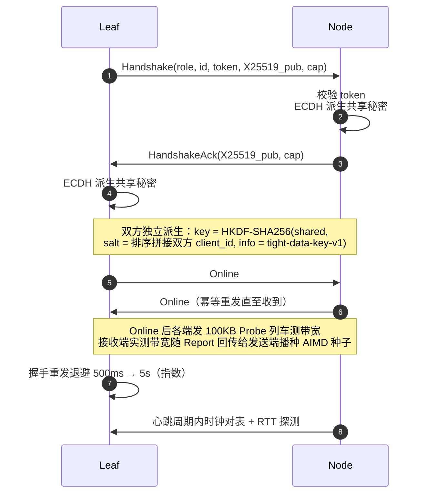

关键点：

- **密钥派生 salt = 双方 client_id 排序拼接**：两端得到相同 salt 且与具体
  发起方向无关；
- **握手报文是 ackable 的**：进入 `m_pending`，接收方以 Ack 回执；重发前
  清除陈旧握手挂账，避免"pending 非空永不重发"死锁；
- **时钟对表在握手时执行**（无 RTT 样本时先按单向时延粗对，再平滑），
  心跳持续重对表跟踪漂移；
- **Online 通告按心跳周期幂等重发**：弱网下单次 Online 丢失不会让对端
  应用层状态永久停在 Established。

## 5. 数据面可靠性设计

### 5.1 可靠性栈（分层兜底）

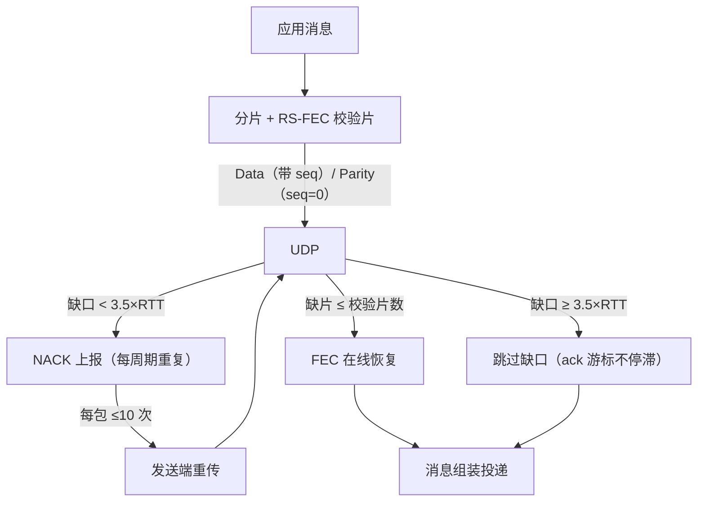

| 机制 | 说明 |
|---|---|
| ACK | 握手/Online 等 ackable 控制包回执，`m_pending` 按 ack 剪枝 |
| NACK | 接收端缺口序号在报告周期内重复上报（Report 丢失不致命）；缺口 ≥ 3.5×RTT 跳过（游标不停滞），迟到重传照常投递 |
| 重传上限 | 每包最多重传 10 次（`kMaxRetries`），耗尽静默丢弃 |
| FEC 兜底 | 缺片 ≤ 校验片时 RS 解码在线恢复；恢复失败 → `on_message_loss(peer, channel)` 通知应用（视频请求关键帧） |
| 重传协商 | 握手能力位通告；任一端关闭即全链路不再保留重传缓冲（在途内存常数化 ~24KB），纯 FEC 兜底 |
| per-channel ARQ | `channel_reliable[8]`：可靠通道缺口参与 NACK；不可靠通道缺口立即跳过（实时视频低延迟） |

### 5.2 序号设计（防"幽灵序号"）

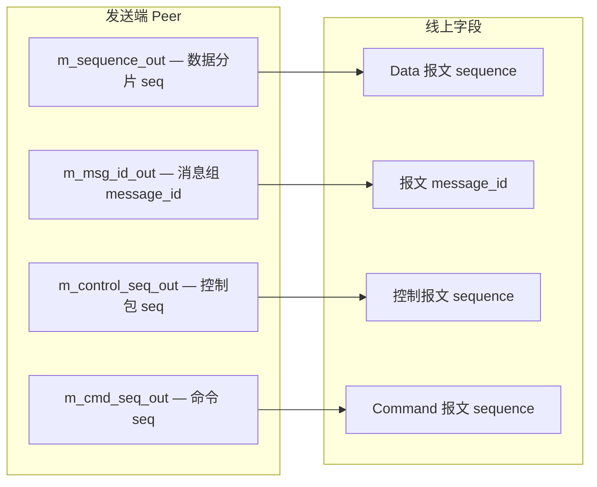

这是**四个独立计数器**，三条理由：

1. **控制包序列号独立**：控制包（Handshake/HandshakeAck/Online/Heartbeat/Bye）
   永不作为 Data 分片到达，若与数据共用序号会污染缺口跟踪基准（基准卡死）；
2. **message_id 独立于 sequence**：一条消息消耗多个序号，若共用计数器，
   对端会出现"永不到达"的幽灵序号 → 全部误报丢包 → ack 冻结、`m_pending`
   无限堆积（内存泄漏）；
3. **命令通道独立**：命令单报文直发，与数据面完全分离（见第 9 节）。

**Parity 报文 seq=0**：校验片不参与缺口跟踪（校验片丢失时数据片齐即可
组装，无需重传），同时防止 Parity 先到抢先初始化序列基准。

### 5.3 接收端组装流程

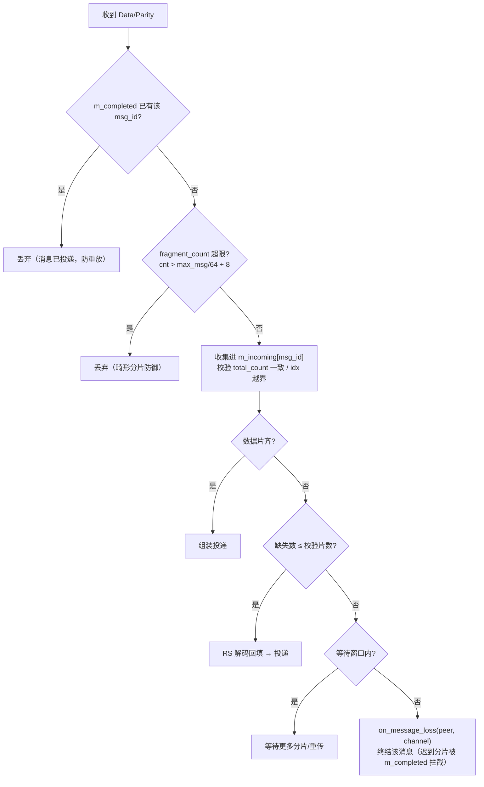

- 等待窗口：可靠通道 = 12 个报告周期（对齐发送端放弃时限）；不可靠通道 =
  max(250ms, 2×RTT)（快速止损）；
- `m_incoming` / `m_completed` 按 `dead_timeout` 周期清理。

## 6. FEC 冗余自适应设计

### 6.1 编码方案

- Reed-Solomon，GF(2⁸)，本原多项式 0x11D，Vandermonde 编码矩阵
  `coef(p, j) = (j+1)^p`；**第 0 校验片 = 全体数据分片 XOR**；
- 数据流加 **4 字节大端总长前缀**，接收端按前缀裁剪补齐的尾部；
- 短尾分片按零补齐编码（与补齐后编码结果一致），零拷贝 span 区间视图。

### 6.2 分段自适应状态机（迟到率驱动）

迟到率 p = 单程传输时间超过**迟到线**的报文占比。迟到线两种模式：
`late_buffer_ms > 0` 时 = P50 + late_buffer_ms（视频 16ms，动态直方图线）；
否则 = `late_rtt_multiplier × RTT`。

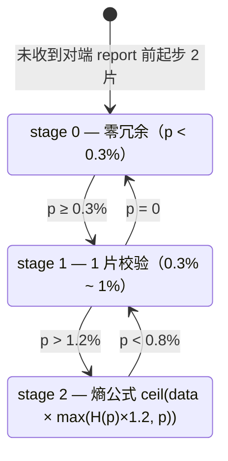

- 档位切换带 **±20% 迟滞**（1%×1.2 升档 / 1%×0.8 降档），防振荡；
- 熵公式：`H(p) = -p·log₂p - (1-p)·log₂(1-p)`，冗余 = `max(H×1.2, p)`
  （高 p 区间冗余跟随 p 单调上升），**冗余率上限 20%**（防拥塞/长尾场景
  冗余过大加剧排队——L4S 弱网实测 fec=100% 使线上超发、恶性循环；单分片
  消息至少 1 片保护），再受 100 片安全阀门；
- 通道固定冗余 `channel_fec_extra[8]`（如音频通道 +1~2 片）与 AIMD 恢复
  台阶的 FEC 探测冗余叠加其上，总校验片封顶 data_count；平滑 RTT>200ms
  或 CE>1%（L4S 场景 CE 即丢包信号，冗余无用且加剧排队）时全部归零让出
  带宽（丢包型随机丢包**不关**——丢包正是 FEC 的工作对象，实测误关
  64 帧 nokey vs 全开 1 帧）。

### 6.3 FEC 探测冗余（AIMD 恢复台阶）

AIMD 恢复提升的第一步先压上 2 片 FEC 校验片负载感知链路（FEC 可丢失、
不伤业务：对端缺校验片不影响数据片组装），第二步确认链路有余量后移除，
业务流量自然替换 FEC 流量（`video_capacity_bps` 按实际冗余率折算，探测片
移除后冗余率回落 → 编码码率上升）。探测冗余仅作用于通道 0（视频），
避免干扰音频稳定传输。

## 7. 拥塞控制设计（三信号 AIMD，GCC 风格）

### 7.1 模型

```mermaid
flowchart LR
    subgraph Sample["信号来源（全部来自对端报告，每 report_interval 评估一次）"]
        R1["delay-based：排队延迟 = P50 − RTprop<br/>（发送端对报告 P50 做 min filter）EWMA 平滑"]
        R2["late-based：迟到率 p（超迟到线或丢失，<br/>L4S 时丢失并入 CE 替代）"]
        R3["loss-based：纯丢包率（令牌受限时替代迟到率——<br/>本地排队是伪信号，丢包才是链路真信号）"]
        R4["ECN/L4S：CE 标记占比（直接拥塞信号，>1% 即判）"]
        R5["pacer_limited：本地令牌限速中<br/>（迟到/延迟信号豁免，防崩底死锁）"]
    end
    subgraph Est["BandwidthEstimator（AIMD，带迟滞）"]
        B1["拥塞（延迟>20ms 或迟到率>2% 或丢包率>2% 或 CE>1%）<br/>→ btl ×0.5（令牌受限 ×0.75 温和）"]
        B2["恢复（延迟<10ms 且 迟到率<0.5%）两步台阶：×1.5 + FEC 探测冗余<br/>（CE 活跃时跳过探测）→ 无拥塞再 ×1.5 移除 FEC，连续爬升"]
        B3["中间区保持不动（防摆动）"]
        B4["下限 100kbps；提升上限 = 配置种子"]
    end
    subgraph Out["输出"]
        P1["令牌桶 pacing 速率"]
        P2["FEC 探测冗余片数（fec_probe_extra）"]
        P3["video_capacity_bps（视频可用码率）"]
    end
    Sample --> Est --> Out
    Out -->|"rate = btl"| TB["令牌桶（cap = max(4×mtu, bps×0.02)）"]
    TB -->|"sendto 前扣减"| NET["UDP"]
```

### 7.2 判定与调整规则

| 规则 | 理由 |
|---|---|
| 拥塞信号（带迟滞）：排队延迟 EWMA > 20ms（非令牌受限）或 迟到率 > 2%（非令牌受限）或 **丢包率 > 2%（令牌受限时替代迟到率）** 或 **CE 占比 > 1%（L4S 直接信号）** → btl 乘性下降 | 实时流语义：延迟超线即"丢"；以报告为准立即响应；L4S 下 CE 即丢包替代（接收端 CE 活跃时丢包不再额外计入迟到率，防双倍惩罚） |
| **令牌受限（pacer_limited）时只用真实链路信号**：迟到率主体是本地排队伪信号（应用码率下限 > 令牌 → outbound 积压 → 接收端 p50 超线），降速无益；丢包率（网络真丢）与 CE（proxy 链路积压）才是链路信号 | 防"令牌卡死 → late 100% → 连降崩底 12.5K"死锁（L4S 实测）；令牌受限时降速系数 ×0.75 温和（令牌已低于供给，说明 btl 接近链路，剧烈降速只制造本地排队） |
| **恢复判定更严（迟滞）**：延迟 < 10ms **且**（迟到率 < 0.5%，或令牌受限时丢包率 < 0.5% 且 CE < 1%）才提升；中间区保持不动 | 消除"刚过阈值就反向"的摆动（弱网段实测 btl 在 0.2~0.8M 振荡的根源） |
| 恢复两步台阶：第一步 ×1.5 + FEC 探测冗余，第二步无拥塞再 ×1.5 并移除 FEC，台阶走完回到起点连续爬升 | 台阶间隔一个报告周期观察，防抖动误提；FEC 可丢失、不伤业务；**CE 活跃（L4S）时跳过 FEC 探测**（CE 即链路反馈，探测冗余使线上超发 → 更多 CE → 连降自伤）；连续爬升直到种子上限或拥塞信号 |
| btl 下限 100kbps（`kMinBtlBps=12500`） | 长距离高 RTT 误判时防打穿 |
| 提升上限 = `initial_bandwidth_bytes` 种子 | 防台阶把种子推高振荡；默认 10Mbps（实时音视频常用上限，避免大种子起步弱网段超发） |
| ACK 样本只维护平滑 RTT（bytes 忽略） | 投递率样本不再参与估计；ACK 只在握手期出现，RTT 可能被拥塞队列放大成毒样本 |
| app_limited 判定 = 出站队列 ≤8 且最近 500ms 无应用发送 | 音视频混合流下音频 50fps×2 包让队列常驻 >1，阈值 1 会令 app_limited 永不生效 |
| `congested()` / `delay_congested()` 状态输出 | 大量阻塞（排队型）时 FEC 冗余让出带宽——排队型拥塞冗余加剧排队，丢包型（随机丢包）冗余有效对抗丢包，不能一并关闭（丢包场景实测 69 帧 nokey vs 全开 1 帧） |

### 7.3 视频可用码率（video_capacity_bps）

```
video_capacity_bps = (btl×8 − audio_reserved_bps×(1+channel_fec_extra[1])
                      − file/data 实时发送速率) / (1 + 实际 FEC 冗余率)
```

- 音频预留 = 音频编码码率 ×（1 + 通道 1 校验片开销）；
- file/data 实时速率按采样窗口（调用频率即采样频率）扣除；
- 实际 FEC 冗余率 = 校验片/数据片（fragmenter 滑动窗口 1s 累计，全 peer 比）；
- 变化 >10% 且 >100kbps 才通知应用（专用通知线程回调，防频繁触发）。

### 7.4 FEC 关闭（RTT>200ms 或 CE>1%）

平滑 RTT 长期 >200ms（长距离或重拥塞）或 CE>1%（L4S 场景：CE 即丢包
信号，网络不丢包只标记）→ `peer.m_fec_disable` 置位：起始保护/自适应/
通道额外/探测冗余**全部归零**——少量阻塞时冗余恢复有用，大量阻塞时冗余
本身挤占带宽加剧拥塞，让出带宽给数据；回落自动恢复。**丢包型随机丢包
不关 FEC**（丢包正是 FEC 的工作对象；video_capacity 已按实际冗余率折算，
冗余不额外超发——此前用 loss/delay/pacer 组合关闭实测误伤：丢包稀疏
时 FEC 在丢包间隔被关闭 → 无法恢复 → 64 帧 nokey vs 全开 1 帧）。

### 7.5 令牌桶与直发通道

- **音频通道（ch1）独立出站队列**：容量 128（≈1.2s 音频，40ms×2 包），
  sender 优先清空且**绕过令牌桶**（实时音频无条件一次性发完，不受贷款/
  令牌限制；满则静默丢，与普通队列一致）；
- **令牌贷款（`loan_seconds`，默认 5s）**：共享令牌桶（视频 ch0 + file/data
  ch2/3）允许视频**透支**，额度 = btl×loan_seconds（动态随 btl 收窄——
  弱网超发危害越大，可贷额度越小）。贷款用途：① 视频帧随心跳一次性发完
  （不被 10ms 打平）；② 覆盖编码联动延迟（1~2s）——上层改码率失败/未生效
  期间允许有限超发。超限（连续弱网 + 联动失效）→ 清空视频队列 + 持续排空
  视频通道至债务清零 + `LoanExhaustedCallback(true)`（应用停止推流/降码率）；
  债务清零（token ≥ 0）→ 恢复发送 + 回调 `false`（应用重启编码器出关键帧）；
  `loan_seconds=0` 禁用贷款（视频严格令牌）；
- **视频（ch0）**：足额消费或贷款透支，不 sleep 打平（帧分片连发）；
  **file/data（ch2/3）**：严格令牌（带宽分配器），不足等下一心跳；
- **控制面直发**（绕过队列与令牌桶）：Report / 命令 / 握手重传 / NACK 重传。
  理由：报告在 echo 洪泛时排队 ~7s 会令拥塞信号过期、btl 响应被拖延；
  重传量低（弱网 ~4%），直发不破坏限速语义。

## 8. 时钟对表与延迟统计

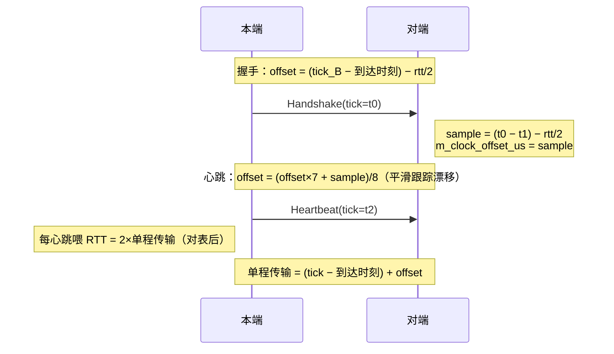

- 本端时钟永不被修改，只维护**对端时钟偏移**；
- 无 RTT 样本时先按单向时延直接对表（不能推迟——RTT 样本依赖偏移，推迟
  形成循环依赖）；
- 接收端按单程传输时间统计 8ms/bin × 256 直方图（0~2048ms），报告周期末
  算 P50（迟到线基准）、超线比例 p（FEC 冗余驱动）与 P99.9 尾部均值
  （延迟曲线诊断），`p50_ms` 随报告上发送端（视频延迟信号码率控制）。

## 9. 命令通道保序设计

命令单报文（≤ 单包载荷），不经分片/重组/FEC，**插队直发**。

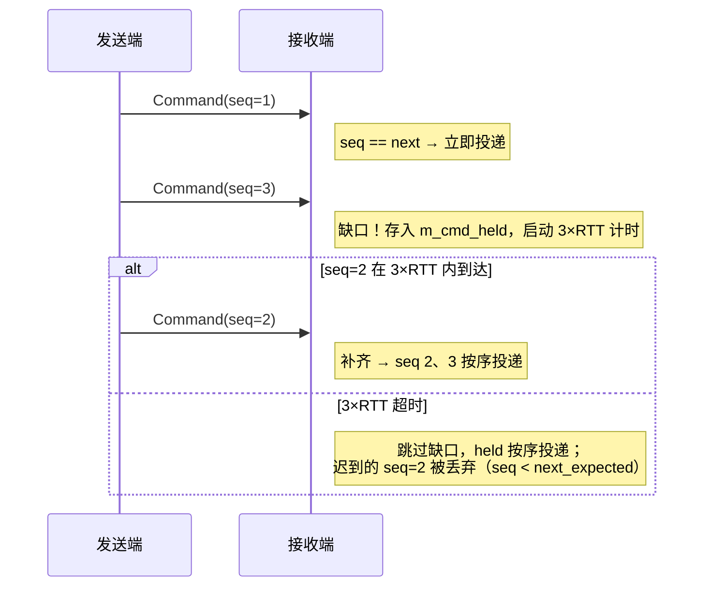

- 缺口的等待窗口 = 3×RTT（无 RTT 样本时按 10ms 计）；
- 周期 `flush_commands` 兜底超时跳号（即使无新命令到达）；
- 重连（重新握手）时 `CommandChannel::reset` 清空两侧状态。

## 10. 线程与内存设计

### 10.1 线程模型

| 模式 | 线程 | 职责划分 |
|---|---|---|
| 普通 | 4 | reactor（节拍/调度）、receiver（recvfrom）、encode（分片+FEC+加密）、sender（令牌桶+sendto） |
| lite | 1 | reactor 节拍内顺序合并 drain_receiver / drain_encode / drain_sender |

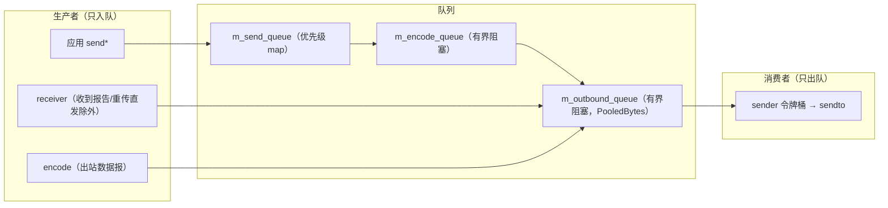

**单生产者多消费者**原则：任何 socket 阻塞（令牌桶背压）都不会阻塞
reactor/encode/receiver。lite 模式运行时切换：先让 reactor 接管再回收
线程（或反之先清 `m_lite_pending` 再启动工作线程），队列容量按构造时
配置固定。

### 10.2 内存设计

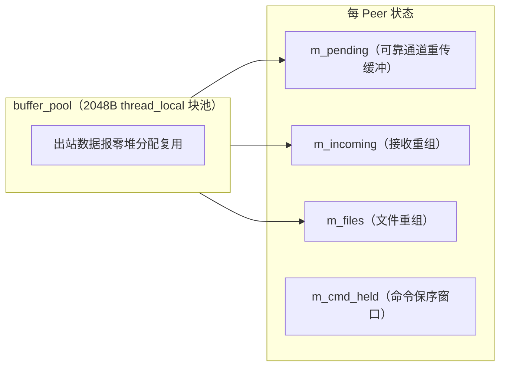

| 优化 | 位置 |
|---|---|
| 出站缓冲池（2048B 块，thread_local 无锁） | `buffer_pool.hpp` |
| BlockingQueue 节点回收池（上限 64） | `blocking_queue.hpp:134` |
| FEC span 区间视图 + 校验缓冲 thread_local 复用 | `fragmenter.cpp` |
| 接收流式 CRC 免拷贝 | `packet_codec.cpp` |
| lite 钳制：queue≤128 / encode≤64 / outbound≤256 / socket≤16KB | `transport.cpp` |
| GCM nonce / AAD 栈缓冲零堆分配 | `transport.cpp` |

内存档案：普通模式空闲 ~460KB；lite 空闲 ~76KB；lite 无重传在途**常数
~24KB**（与码率无关）；lite 有重传在途 ∝码率 × 确认窗口，队列封顶最坏
~5.4MB。

## 11. 关键设计决策索引

| # | 决策 | 备选方案 | 选择理由 |
|---|---|---|---|
| 1 | 内置纯 C++ 加密（X25519/SHA-256/HKDF/AES-GCM） | OpenSSL/mbedTLS | 零依赖、交叉编译简单、IoT 可控 |
| 2 | sequence / message_id / 控制序号 / 命令序号四计数器分离 | 统一计数器 | 防幽灵序号 → ack 冻结 + m_pending 泄漏 |
| 3 | Parity seq=0 不参与缺口跟踪 | Parity 也编号 | 校验片丢失无需重传；防基准被 Parity 抢先初始化 |
| 4 | 重传可协商（握手能力位），任一端可单方面关闭 | 固定开启 | 纯实时 AV 场景在途内存常数化（∝码率 → ~24KB） |
| 5 | per-channel 可靠开关 | 全局重传 | 同一链路混跑实时流与可靠流 |
| 6 | 三信号 AIMD（delay-based + late-based + pacer 否决） | BBR 投递率/时间片循环 | 实时流语义"延迟超线即丢"；避免投递率样本依赖（ACK 稀疏、排空误读）与时间片循环复杂性 |
| 7 | 拥塞 → btl ×= 0.5（每报告，无冷却） | 比例响应（DCTCP 式） | 实时流对超发容忍度低，立即减半快速释放队列 |
| 8 | 恢复两步台阶 ×1.5 + FEC 探测冗余 | 直接恢复原值 | 台阶间隔一个报告周期观察防抖动；FEC 可丢失不伤业务，先探测链路余量再提码率 |
| 9 | btl 下限 100kbps、提升上限 = 配置种子 | 无下限/无上限 | 长距离高 RTT 误判防打穿；防台阶把种子推高振荡 |
| 10 | 报告/命令/重传直发绕过令牌桶 | 全部排队 | 报告排队 ~7s 使拥塞信号过期、btl 响应被拖延；重传量低 |
| 11 | FEC 冗余按迟到率熵公式自适应 | 固定冗余率 | 弱网自动加强、干净链路零开销，迟滞防振荡；RTT>200ms 关闭冗余让出带宽 |
| 12 | 时钟对表 + 心跳平滑 | 只握手对表 | 跟踪晶振漂移；单程延迟统计（P50）是 AIMD delay-based 信号源 |
| 13 | 命令 3×RTT 保序窗口后跳号 | 严格乱序丢弃 | 命令通道低延迟可用性 vs 保序 |
| 14 | 文件分块（60KB）+ 块级去重 + ARQ | 整文件一条消息 | 大文件可靠传输 + 内存可控 |
| 15 | lite 运行时切换线程模型 | 编译期二选一 | 同一进程内灵活适配（云端下发策略） |
| 16 | 畸变分片防御（fragment_count ≤ max/64+8） | 信任分片数 | 防恶意洪水预分配耗尽内存 |
| 17 | 视频可用码率回调（video_capacity_bps，>10% 且 >100k 才通知） | 应用自行折算 | 带宽 − 音频预留 − file/data 实时 − FEC 冗余一站式折算；迟滞防频繁回调 |
| 18 | drain_channel 按通道排空（出队即丢） | clear_outbound 全清 | 视频丢帧止损不影响音频/文件；排空期后旧消息从管线三层防漏出 |
| 19 | 令牌贷款（loan_seconds，视频可透支 btl×loan） | 视频严格令牌 | 帧随心跳连发不被 10ms 打平 + 覆盖编码联动延迟；超限硬止损（清空+排空+回调），债务清零自动恢复 |
| 20 | 音频通道独立队列绕过令牌桶 | 与数据共用令牌 | 实时音频无条件一次性发完（40ms×2 包、1.2s 容量），不受贷款/限速影响 |
| 21 | 令牌受限时用丢包率/CE 替代迟到率判拥塞（×0.75 温和降） | 全信号照用 | 本地排队是伪信号（应用码率下限>令牌 → p50 超线），照用会"连降崩底 12.5K"死锁（L4S 实测） |
| 22 | CE 直接作为拥塞信号（>1%）；CE 活跃时丢包不计入迟到率、跳过 FEC 探测、关闭 FEC 冗余 | CE 并入迟到率 | CE 即丢包替代（L4S 网络不丢包只标记）；防 loss+CE 双倍惩罚；冗余在 CE 场景纯浪费且加剧排队（实测 btl 连崩到底） |
| 23 | FEC 冗余率上限 20%（ceil(data×0.2)，最小 1 片） | 仅 100 片安全阀门 | 拥塞/长尾场景冗余过大加剧排队（L4S 弱网实测 fec=100% 使线上超发、恶性循环） |

---

> 配套文档：[架构](tight_architecture.md) · [使用](usage.md) ·
> [API 参考](api_reference.md) · [功能总结](tight_overview.md) ·
> [lite 模式文档集](litemode/README.md)
