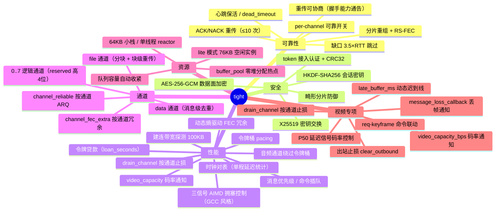
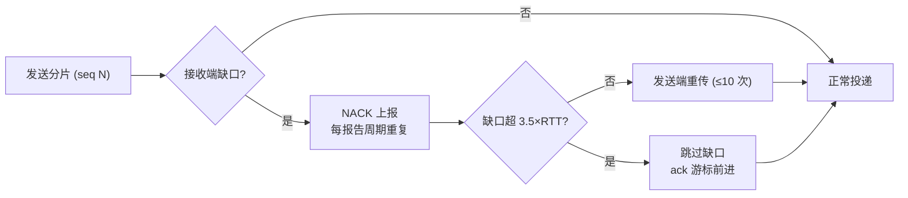
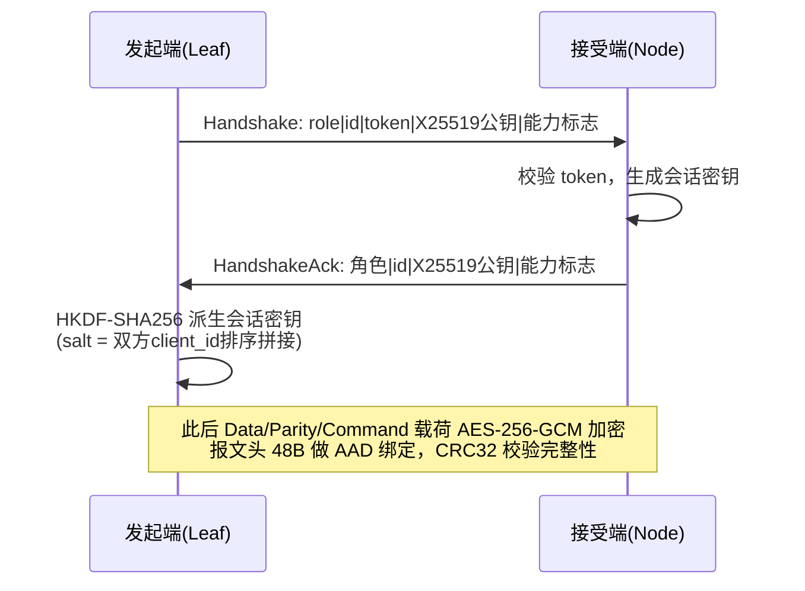
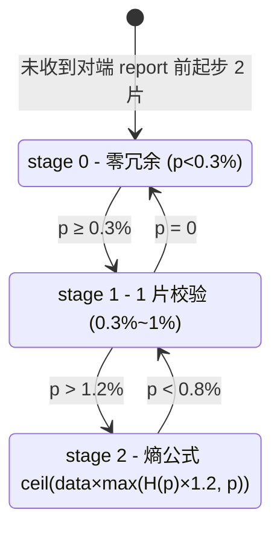
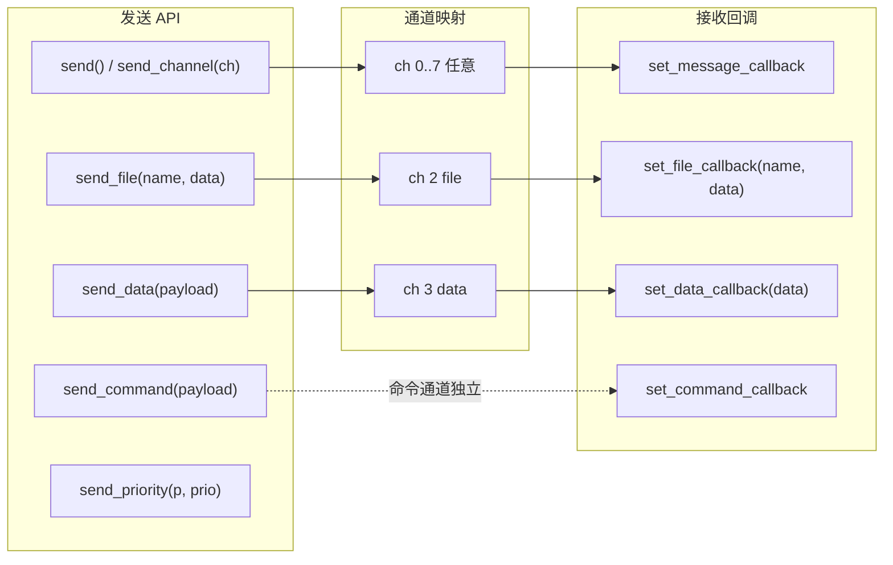

# tight — 功能总结

tight 是一个自包含、零第三方依赖的 C++17 **可靠 UDP 传输协议库**，面向端云实时通信场景（IoT 设备 ↔ 云端网关）：一端是资源充裕的多并发服务器（Node），另一端是 RAM/CPU/功耗受限的嵌入式设备（Leaf），同一份代码、两种运行模式覆盖两侧。

> 文档导航：本文件 = 功能总结；[tight_architecture.md](tight_architecture.md) = 架构；
> [tight_design.md](tight_design.md) = 设计要点；[usage.md](usage.md) = 完整使用文档；
> [api_reference.md](api_reference.md) = API 说明；[litemode/](litemode/README.md) = lite 模式设计文档集。

## 1. 能力全景

## 2. 可靠性

| 机制 | 说明 |
| --- | --- |
| 分片 + FEC | 消息按 MTU 分片，Reed-Solomon（GF(2⁸)）校验片动态冗余，缺片可在线恢复 |
| NACK 重传 | 丢失序号每个报告周期重复上报（Report 丢失不致命）；缺口超 3.5×RTT 跳过（ack 游标不停滞），迟到重传照常投递 |
| 重传上限 | 每包最多重传 10 次，耗尽静默丢弃（文件传输由应用层块校验 + 补发兜底） |
| 保活与掉线 | 心跳（默认 5s）+ `dead_timeout`（默认 30s）掉线检测 + 自动重连；Online 通告按心跳周期幂等重发 |
| 重传协商 | `retransmit_enabled` 经握手能力标志通告，任一端可单方面关闭（纯 FEC 兜底），在途内存从 ∝码率降为常数 ~24KB |
| per-channel ARQ | `channel_reliable[8]` 按通道开关重传：可靠通道（file/data）参与缺口重传，不可靠通道（实时视频）缺口立即跳过 |

## 3. 安全

- 握手 X25519 密钥交换（RFC 7748），HKDF-SHA256 派生会话密钥；
- 数据面 AES-256-GCM 加密（`kFlagEncrypted` 标志），可配置开关 `encryption_enabled`；
- token 接入认证 + CRC32 完整性 + `max_message_bytes` 畸形分片防御（防内存耗尽）。

## 4. 性能

### 4.1 动态 FEC 冗余（分段状态机）

- 超线比例 p = 单程传输时间超过**迟到线**（`P50 + late_buffer_ms`，视频 16ms）的报文占比；
- 熵公式 H(p) 按迟到概率信息量驱动冗余率，带 ±20% 迟滞防振荡，100 片安全阀门；
- `channel_fec_extra[8]` 按通道叠加固定冗余（如音频通道单独加强）。

### 4.2 三信号 AIMD 拥塞控制（GCC 风格）

```mermaid
flowchart LR
    subgraph S["信号（全部来自对端报告，每 report_interval 评估一次）"]
        R1["delay-based：排队延迟 = P50 − RTprop（发送端对 P50 做 min filter）<br/>EWMA 平滑趋势"]
        R2["late-based：帧级迟到率 p（帧延迟 > F/btl + late_buffer<br/>才算迟到——关键帧突刺不算）"]
        R3["loss-based：纯丢包率（令牌受限时替代迟到率——本地排队是伪信号）"]
        R4["ECN/L4S：CE 标记占比（直接拥塞信号，>1% 即判）"]
        R5["sustained_overload：报告期平均发送 > 接收速率<br/>（突刺门控：非持续超发不降速）"]
    end
    subgraph E["BandwidthEstimator（AIMD，统一柔表 + 迟滞 + 排空冻结）"]
        B1["持续超发按强度统一柔表降速（CE 与 late/loss 共享）：<br/>≥50%→×0.50 · ≥20%→×0.65 · ≥5%→×0.75 · ≥1%→×0.90"]
        B2["排空窗口内 btl 完全冻结（不降不升）"]
        B3["恢复（延迟<10ms 且 p<0.5%）两步台阶 ×1.5<br/>上限 = min(种子, max(btl, recv×1.2))；CE 活跃跳过探测"]
        B4["下限 100kbps；probe 起步校准只钳制 btl 不锁种子"]
    end
    subgraph O["输出"]
        P1["令牌桶 pacing 速率"]
        P2["FEC 探测冗余片数（fec_probe_extra）"]
        P3["video_capacity_bps（视频可用码率）"]
    end
    S --> E --> O
```

关键规则：

- **突刺门控**：报告期平均发送 ≤ 对端接收速率时，CE/late 是关键帧突刺的
  瞬时信号（I 帧 40-60KB 在低带宽链路瞬时排队数十 ms = 帧自身传输）——
  **不降速**（btl 保持，突刺排空后恢复台阶自然回升，避免 I 帧排队把 btl
  打崩：30M→0.23M 崩底 → 贷款循环）；
- **统一柔表降速**（持续超发时，strength = max(late, loss, ce)——CE 与
  late/loss 共享同一张表）：≥50%→×0.50、≥20%→×0.65、≥5%→×0.75、≥1%→×0.90，
  最大降 50%、降幅 <20%（×0.90）不触发排空窗口。CE 急表（×0.45/×0.30）曾致
  btl/码率大幅跳变 → QSV 编码器频繁重启（60s 17-36 次）→ 设备崩溃/断流
  （L4S 实测）；柔降渐变收敛、重启次数与无 CE 网络相当（~12-15 次）；
- **排空窗口内 btl 冻结**：量化大降进入排空窗口后，late/CE/loss/delay 全部
  豁免（不降不升）——排空/追赶期的迟到信号是伪拥塞（播放端补历史欠账），
  继续降是盲猜；窗口结束（3s）后信号仍在才允许下一次下降；
- **帧级迟到率**：接收端逐帧统计（帧延迟 = 完成时刻 − 首片发送 tick、帧
  大小 F），发送端以合理到达时间 = F/btl + late_buffer 判定迟到——关键帧
  突刺是帧自身传输不误报；
- **恢复爬升约束**：上限 = min(配置种子, max(btl, 对端接收速率×1.2))——
  快排跳帧清掉迟到信号后爬升失去反馈会立即爬满格 → 又超发又降又排空的
  循环；令牌受限期不约束（recv_rate ≈ 令牌速率，约束会自锁）；
- **拥塞排空窗口双模式**：fast（降幅 ≥35%，因子 ≤0.60：×0.50/×0.65 档，
  strength≥20% 重/严重拥塞——清空视频积压 + 通道排空 + `EvacKeyframeCallback`
  重启编码器出新 IDR，播放端跳帧、积压瞬间归零；窗口结束 = 新 IDR 提交发送
  （`send_video(keyframe=true)`）+ 下一报告到达，5s 兜底）/ slow（降幅 25%，
  ×0.75——Q 面积法 3s 排完积压，不跳帧）；×0.90（<20%）不触发窗口；
- **起步带宽校准**（probe 测速）：btl 钳制 ≤ 实测链路容量（不锁种子）——
  固定 30M 种子在 4M 链路硬发 → 大步量化崩底；probe 测偏只慢爬不卡死；
- **CE 最小样本门槛**（<20 报文不判 CE）：发送受限/暂停期小分母放大 CE
  尾流虚高误判；**令牌受限只信 CE**（late/loss 是本地限速伪信号）；
- 恢复判定更严（迟滞）：延迟 < 10ms **且** 迟到率 < 0.5% 才提升；中间区
  （10~20ms 或 0.5%~2%）保持不动——消除"刚过阈值就反向"的摆动；
- **令牌贷款**：视频可透支 btl×`loan_seconds`（默认 5s，覆盖编码联动延迟
  1~2s），超限硬止损（清空积压 + 持续排空视频 + `LoanExhaustedCallback(true)`），
  债务清零自动恢复（回调 false，应用重启编码器出关键帧）；
- **音频通道独立队列绕过令牌桶**：实时音频无条件一次性发完（40ms×2 包、
  1.2s 容量），不受贷款/限速影响；
- RTT 长期 >200ms **或 CE>1%**（L4S：CE 即丢包信号）→ 关闭 FEC 冗余（冗余
  让出带宽给数据；**丢包型随机丢包不关**——丢包正是 FEC 的工作对象，
  实测误关 64 帧 nokey vs 全开 1 帧）；
- **报告停滞降速**：Report 连续 3×report_interval 收不到 = 链路严重卡顿/断流
  → btl ×0.5 **单次降**（one-shot 防盲猜过冲，下限 100kbps），报告恢复后
  恢复台阶自然回升——提前于贷款硬止损（~5s）与掉线检测（30s）；仅
  Online/Established 链路、全部活跃 peer 均停滞才降，握手时重置报告时间戳
  防重连误触发；
- FEC 冗余率上限 20%（防拥塞/长尾场景冗余过大加剧排队；单分片消息至少
  1 片保护）；建连测速列车播种 btl；ACK 样本只维护平滑 RTT。

## 5. 逻辑通道

通道号 0..7 写入数据报 `reserved` 高 4 位（`channel << 12 | real_size`），接收端据此识别：

| 通道 | 用途 | 可靠性 |
| --- | --- | --- |
| 0 | 默认（视频/数据） | 纯 FEC（视频场景），可 `channel_reliable[0]` 开启 |
| 1 | 常作音频通道 | `channel_fec_extra[1]` 单独加强冗余 |
| 2 | **file 通道**（`send_file`） | 可靠 ARQ（`channel_reliable[2]=true`）+ 块级重传 + 去重 |
| 3 | **data 通道**（`send_data`） | 可靠 ARQ（`channel_reliable[3]=true`）+ 消息级 only-once 去重 |
| 4..7 | 应用自定义 | 按需配置 |

file 消息格式（大端）：

| 消息 | tag | 载荷 |
| --- | --- | --- |
| manifest | `0x01` | `file_id(4) name_len(2) name total(8) chunk_size(4) chunk_count(4)` |
| chunk | `0x02` | `file_id(4) idx(4) data`（`kFileChunkSize=60KB`，chunk 消息 ≤64KB 上限） |
| data | `0x03` | `payload` |

接收端按 file_id 重组（`m_files`），块级去重（已收块直接忽略），全部到齐后在锁外拼装并经 `set_file_callback` 交付。

## 6. 视频场景专项接口

| 接口 | 作用 |
| --- | --- |
| `set_video_capacity_callback(cb)` | **视频可用码率通知**：有效带宽 − 音频预留 − file/data 实时速率 − FEC 冗余折算后的编码码率，变化 >10% 且 >100kbps 才回调（专用通知线程，回调须快速返回） |
| `video_capacity_bps()` | 同上的轮询版；`audio_reserved_bps` 为音频预留（含 `channel_fec_extra[1]` 校验开销） |
| `fec_redundancy_ratio()` | 实际 FEC 冗余率（校验片/数据片，滑动窗口 1s） |
| `set_loan_exhausted_callback(cb)` | **令牌贷款耗尽/恢复通知**：视频透支超限 → 暂停发送（持续排空）+ `cb(true)`；债务清零 → 恢复 + `cb(false)`（应用重启编码器出关键帧） |
| `set_evac_keyframe_callback(cb)` | **拥塞排空窗口触发通知**（fast 模式）：tight 已清空视频积压并排空视频通道 → 应用重启编码器（force_keyframe → 新 IDR + 低码率），播放端跳帧、积压瞬间归零 |
| `send_video(peer, payload, keyframe)` | 发送视频帧（通道 0，贷款连发）；keyframe 标记 IDR——fast 排空窗口以此识别"新 IDR 已提交发送"作为结束条件之一 |
| `drain_channel(ch[, dur])` | **按通道止损**：排空期内该通道数据报出队即丢（不清队列），音频/文件通道不受影响；默认 100ms，期满自动恢复 |
| `set_message_loss_callback(peer, channel)` | 重组失败（丢帧）通知 → 应用发 `req-keyframe` 命令快速恢复画面 |
| `late_buffer_ms` | 动态迟到线 = P50 + late_buffer_ms（视频 16ms），超线报文计入迟到率 p |
| `peer_p50_ms(peer)` | 对端上报的单程延迟中位数（AIMD 的 delay-based 信号源） |
| `outbound_queue_size()` | 出站积压数据报数（本地即时拥塞信号） |
| `clear_outbound()` | 丢帧止损：清空数据面积压（**保留音频**：priority≥1 与 channel=1 编码任务回退），配合 `force_keyframe` |
| `file_data_pending_bytes()` | file/data 待发负载，供带宽预算（有负载时视频让出一半 btl） |
| `estimated_bandwidth_bps()` / `btl_bw_bps()` | 拥塞控制观测（注意 `btl_bw_bps()` 返回 bytes/s） |

## 7. 资源与运行模式

| 模式 | 线程 | 空闲实例 | 传输在途增量 |
| --- | --- | --- | --- |
| 普通（服务器） | 5（reactor/receiver/encode/sender + 码率通知） | ~460KB | ≈ 码率 × 确认窗口 |
| lite Audio（IoT 音频） | 2（单线程 reactor 合并收发编 + 码率通知） | **~76KB**（队列更小可再降） | 有重传 ∝码率；无重传常数 ~24KB |
| lite Video（IoT 视频） | 3（独立 receiver + reactor + 码率通知） | ~76KB+ | 有重传 ∝码率；无重传常数 ~24KB |

lite 队列钳制按业务画像（`lite_profile`）：**Audio** encode≤16 / outbound≤32 /
queue≤64 / socket≤4KB / 音频队列 48（音频 20ms×2 包 + 333ms 报告 = 32 包 +
2s 余量）；**Video** encode≤64 / outbound≤256 / queue≤128 / socket≤16KB。
`fec_enabled` 关闭后不生成/不解码校验片（省在途缓冲 + RS 解码 CPU，丢包由
应用层容错兜底）。`set_lite_mode()` 运行时动态切换。

## 8. 关键配置摘要

| 配置 | 默认 | 说明 |
| --- | --- | --- |
| `mtu` | 1350 | 单包载荷 = mtu-48-16(GCM)=1286B，整包容纳 16kHz PCM 40ms 帧（1280B） |
| `max_message_bytes` | 64KB | 单消息上限，钳制 [8KB, 10MB] |
| `heartbeat` / `dead_timeout` | 5s / 30s | 保活与掉线检测 |
| `report_interval` | 1s（视频 333ms） | ACK/NACK + 迟到率 + 投递率上报周期 |
| `retransmit_enabled` | true | 数据面重传总开关（握手能力通告） |
| `encryption_enabled` | true | X25519 + AES-256-GCM |
| `speed_test_bytes` | 100KB | 建连带宽探测列车 |
| `initial_bandwidth_bytes` | **3.75MB（30Mbps）** | AIMD 初始 btl 与**提升上限**（种子）；弱网下由报告量化收敛 |
| `audio_reserved_bps` | 0 | 音频编码码率，`video_capacity_bps` 计算时扣除（校验片按 `channel_fec_extra[1]` 叠加） |
| `loan_seconds` | 5.0 | 令牌贷款时间窗：视频可透支额度 = btl×loan_seconds；0 = 禁用 |
| `slowdown_window_ms` | 3000 | 拥塞排空窗口：剧烈降速后窗口内输出排空码率；0 = 禁用 |
| `socket_buffer_bytes` | 8MB（lite Audio ≤4KB / Video ≤16KB） | 内核收发缓冲 |
| `lite_mode` / `lite_profile` | false / Audio | 精简模式与业务画像（Audio 极致低内存单线程 / Video 独立 receiver 双线程） |
| `fec_enabled` | true | 数据面 FEC 总开关（lite 建议关闭，应用层容错兜底） |

## 9. 线格式摘要

- 报文头 **48B**：magic `0x54474854`、version 1、type（Handshake=0…Command=10）、flags（bit15=加密标志，低位=数据分片数 data_cnt）、client_id、session_id、sequence、acknowledgment、message_id、fragment_index/count、payload_size、reserved（高4位=通道号，低12位=real_size）、tick、CRC32；
- 握手载荷：`role | id_size | id | token | X25519 公钥(32B) | 能力标志(1B)`（bit0 = retransmit_enabled）；
- Report 载荷：ack 游标(4) | 迟到率×10000(2) | 丢失序号数(2) | reserved(4) | 丢失序号列表(4N) | 可选测速带宽(4) | 投递率(4) | p50_ms(2) | ce_ratio(2)。
